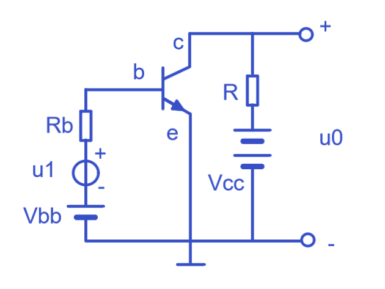
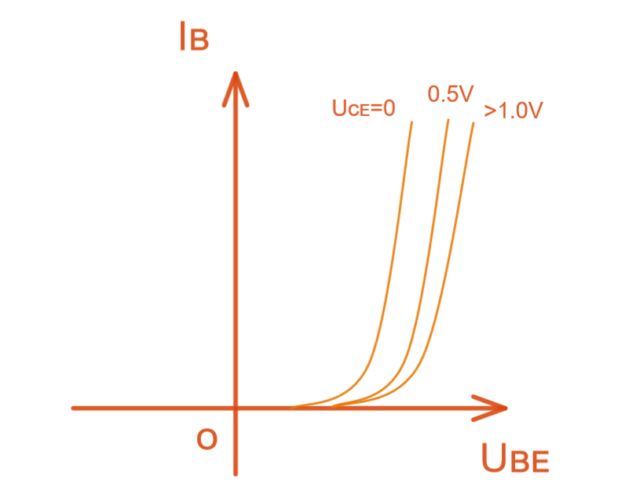
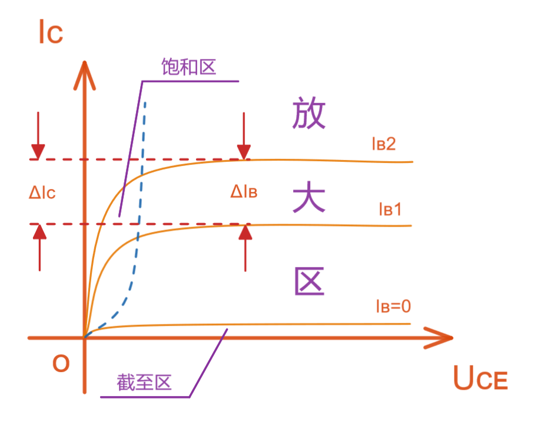
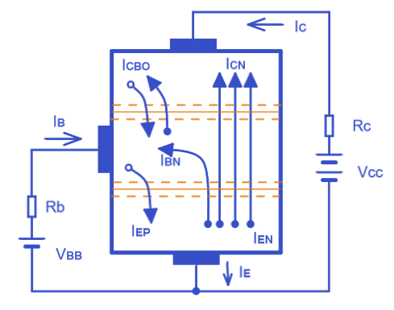

# 上海交通大学-模拟电子技术-笔记-7-三极管特性曲线-共射

[TOC]

 ₀ ₁ ₂ ₃ ₄ ₅ ₆ ₇ ₈ ₉ ₊ ₋ ₌ ₍ ₎ ₐ ꜀ ₔ ₑ ₕ ᵢ ⱼ ₖ ₗ ₘ ₙ ₒ ₚ ᵣ ₛ ₜ ᵤ ᵥ ᙮ ᵤ ᵩ ᵦ ₗ ˪ ៳ ៷ ₒ ᵨ ₛ ៴ ᵤ ᵪ ᵧ .

ᴀ ʙ ᴄ ᴅ ᴇ ғ ɢ ʜ ɪ ᴊ ᴋ ʟ ᴍ ɴ ᴏ ᴘ ǫ ʀ s ᴛ ᴜ ᴠ ᴡ x ʏ ᴢ

BJT 双极型晶体管 = 三极管

## 共射特性曲线

### 输入特性曲线

$i_B = f(U_{BE})|_{U_{CE}=const}$

其输入特性曲线是一个曲线簇，可见在CE电压不变时，该曲线类似二极管特性曲线； 

曲线右移是因为Uce增加使集电结吸引电子能力增加，Ube相对减少 如果达到相同电流效果需要更高电压； 

大于1V基本不变：是因为此时集电结反偏电压已经将大部分电子捕获，对基区的电流Ib基本忽略不计（影响很小）,集电极和基极之间的反偏电压过大，导致电子漂移速率远大于发射集扩散到基极的电子，结论就简单了；

ib=ie-ic，uce达到1V之后，集电结电场已经足够强了，能把绝大部分电子收集到集电区 ，故uce再大，ib也减小不了；

### 输出特性曲线

$i_C = f(u_{CE})|_{i_B=const}$

输出特性曲线也是曲线簇；

可见IB在增大，需要电源Vcc提供能量，转换成Ic，但是Vcc就这么大，控制能力有限，所以Ic也会有限，故后期趋于平稳；Ib决定了发货数量，Ic决定了收货空间，当发货数量一定时，收货空间再大也没有用，我能收到的货依然很少；实际上电压源就是恒压提供电流的作用，而所能提供最大电流为Vcc/Rc，并以压榨Uce的生存空间为代价；

放大区内，可见此时只要CE电压足够大，集电极电流由基极电流控制；

截至区内，有一个穿透电流，穿透电流可以理解为，共射极，基极开路IB=0时，C和E之间的电流；这个穿透电流越小越好；

饱和区内，集电极电流不受基极电流控制；此时CE电压很小（或基极电位高于集电极电位），集电结是正偏的，基极电位最高，C和E的电位几乎一样，那么此时基极电流无法控制这个电流，集电极电流全部交给外部电路Vcc和Rc决定； 外电路决定了其极值；

> 虽然内部根据电压原则集电极处于正偏状态，但集电结内电子流动属性不是按照正偏二极管方向，而是依然按照三极管集电结扩散运动方向；

饱和是个让人迷惑的说法，所谓的“饱和”应该是指的“集电极收集电荷的能力饱和了”，其实就是集电结正偏让集电结失去了收集电子能力；

 

放大区：发射结正偏，集电结反偏，此时$ \beta  i_B =i_C$，这时候其实基极电流变化会影响集电极电流变化，Vcc只能提供一定的功率，为了提供这部分电流上升空间，会挤压CE之间的电压空间；

截至区：双结反偏， 发射结电压小于开启电压，其实就意味着截止了，而反偏与截止效果类似；CE断路；让基极电位小于发射结电位即可；

饱和区：双结正偏，饱和电压$U_{CES}$，CE之间短路，当$\beta I_B > I_{Cmax}$时，饱和区，尽管集电极正偏，但基区的大量电子会受到Uce影响产生Ic；

## 主要参数

略

## 温度影响

输入特性

输出特性

Iceo穿透电流会受到温度影响，放大系数ᵦ也会受到影响；

## 光电三极管

通常基极为光输入；

