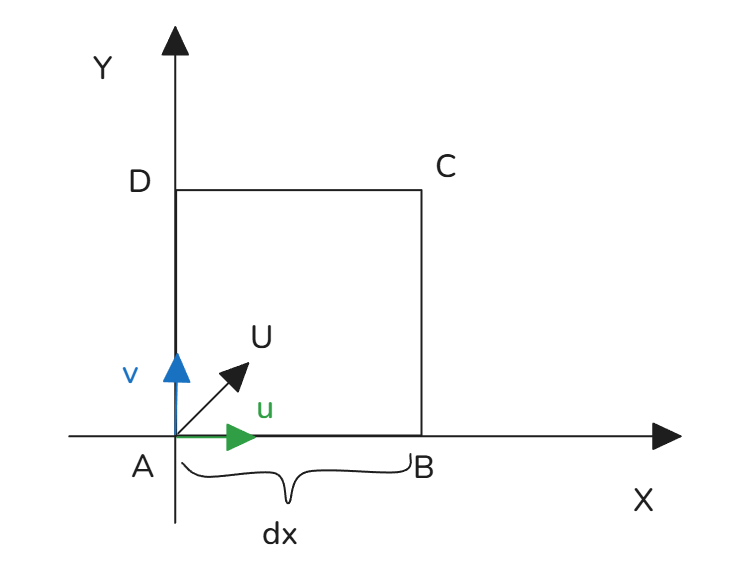
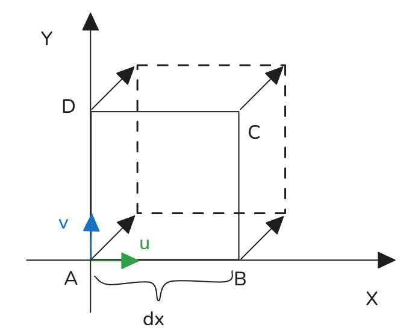
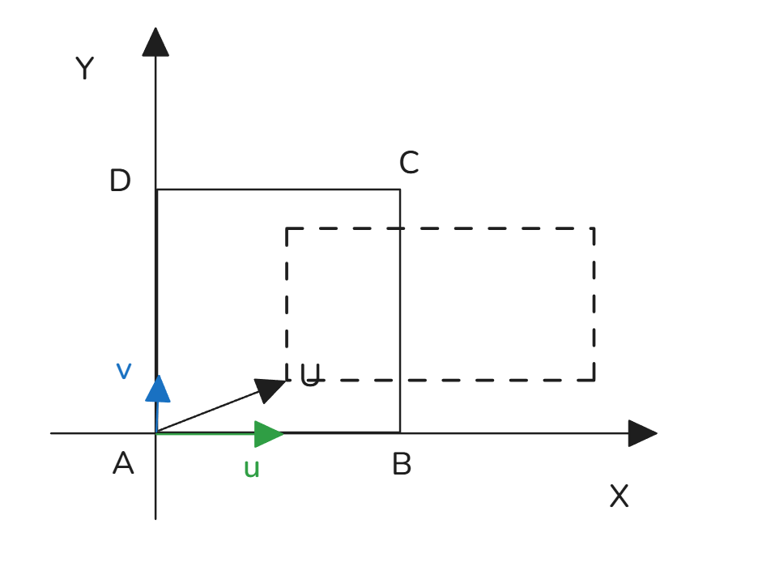
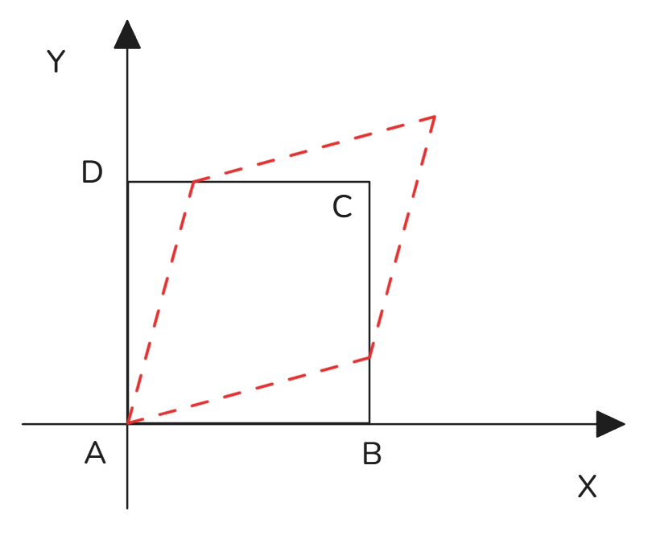

#  NS方程推导

[TOC]

---

## 1 基础物理量（原图手写一字不差复刻）
- 标量(scalar)：$V,\ \rho,\ T,\ t,\ m,\ p$
- 矢量(vector)：$\boldsymbol{U},\ \boldsymbol{L}= m\boldsymbol{U},\ \boldsymbol{F}$
- 张量(tensor)：$\sigma_{ij}$
> 原手稿批注：张量 = relation of vectors（矢量之间映射关系）

### 1.1 速度矢量基础形式
$$
\boldsymbol{U} = u\boldsymbol{i} + v\boldsymbol{j} + w\boldsymbol{k}
$$
列向量：
$$
U = \begin{bmatrix} u \\ v \\ w \end{bmatrix}
$$
转置行向量：
$$
U^T = \begin{bmatrix} u & v & w \end{bmatrix}
$$
矢量模长：
$$
|U| = \sqrt{u^2 + v^2 + w^2}
$$

### 1.2 矢量加法（原图矩阵）
$$
U_1=\begin{bmatrix}u_1\\v_1\\w_1\end{bmatrix},\quad
U_2=\begin{bmatrix}u_2\\v_2\\w_2\end{bmatrix}
$$
$$
U_1+U_2 = \begin{bmatrix}
u_1+u_2\\
v_1+v_2\\
w_1+w_2
\end{bmatrix}
$$

### 1.3 哈密顿$\nabla$算子（原图严格分式）

注意：哈密顿算子，也就是nabla算子 ， 列向量还是行向量根据会实际情况调整；
$$
\nabla =
\begin{bmatrix}
\frac{\partial}{\partial x} &
\frac{\partial}{\partial y} &
\frac{\partial}{\partial z}
\end{bmatrix}
$$

---

## 2 梯度算子全复刻（原图批注保留）
## 2.1 标量场梯度
$$
\nabla  T =
\begin{bmatrix}
\frac{\partial T}{\partial x}\\[3pt]
\frac{\partial T}{\partial y}\\[3pt]
\frac{\partial T}{\partial z}
\end{bmatrix}
$$

## 2.2 矢量场梯度（Jacobi矩阵，原图原样）
$$
\nabla  U =
\begin{bmatrix}
\frac{\partial u}{\partial x} & \frac{\partial v}{\partial x} & \frac{\partial w}{\partial x}\\[3pt]
\frac{\partial u}{\partial y} & \frac{\partial v}{\partial y} & \frac{\partial w}{\partial y}\\[3pt]
\frac{\partial u}{\partial z} & \frac{\partial v}{\partial z} & \frac{\partial w}{\partial z}
\end{bmatrix}
$$
> 手稿原注：
> $\nabla$ 算子**天然是行向量**
> $\nabla$横向量时，对速度的各分量建立偏导；
> $\nabla^T$ 纵向量时，$u,v,w$ 分别做三个方向的求导；所以结果会是个梯度张量；
> 注意分量重叠关系；
> 并积也叫外积；

---

## 3 点积·散度（原图几何+公式双保留）
几何点积：
$$
U_1 \cdot U_2 = |U_1||U_2|\cos\alpha
$$

散度逐分式全展开：
$$
\nabla\cdot \boldsymbol{U}
= \frac{\partial u}{\partial x}
+ \frac{\partial v}{\partial y}
+ \frac{\partial w}{\partial z}
$$
> 手稿原注：散度结果为标量，代表单位体积通量源强度。

---

## 4 叉积·旋度（原图行列式+三级拆分全写满）
几何叉积模：
$$
|U_1\times U_2| = |U_1||U_2|\sin\alpha
$$

旋度行列式（原图原样）：
$$
\nabla\times \boldsymbol{U}
=
\begin{vmatrix}
\boldsymbol{i} & \boldsymbol{j} & \boldsymbol{k}\\[4pt]
\frac{\partial}{\partial x} &
\frac{\partial}{\partial y} &
\frac{\partial}{\partial z}\\[4pt]
u & v & w
\end{vmatrix}
$$

拆分第一项$\boldsymbol{i}$：
$$
\frac{\partial w}{\partial y} - \frac{\partial v}{\partial z}
$$
拆分第二项$\boldsymbol{j}$：
$$
\frac{\partial u}{\partial z} - \frac{\partial w}{\partial x}
$$
拆分第三项$\boldsymbol{k}$：
$$
\frac{\partial v}{\partial x} - \frac{\partial u}{\partial y}
$$

合并矢量式：
$$
\nabla\times\boldsymbol{U}
= \left(\frac{\partial w}{\partial y}-\frac{\partial v}{\partial z}\right)\boldsymbol{i}
+\left(\frac{\partial u}{\partial z}-\frac{\partial w}{\partial x}\right)\boldsymbol{j}
+\left(\frac{\partial v}{\partial x}-\frac{\partial u}{\partial y}\right)\boldsymbol{k}
$$

列向量形式原图复刻：
$$
\nabla\times\boldsymbol{U}
=
\begin{bmatrix}
\frac{\partial w}{\partial y}-\frac{\partial v}{\partial z}\\[3pt]
\frac{\partial u}{\partial z}-\frac{\partial w}{\partial x}\\[3pt]
\frac{\partial v}{\partial x}-\frac{\partial u}{\partial y}
\end{bmatrix}
$$

---

## 5 高斯散度定理（原图手写推导）
基础积分关系：
$$
\iiint_V \nabla\cdot\boldsymbol{U}\,dV
= \iint_S \boldsymbol{U}\cdot\boldsymbol{n}\,dS
= \iint_S \boldsymbol{U}\cdot d\boldsymbol{S}
$$

## 5.1 体积变化率精细推导（逐行复刻）

单位时间内，通过某个微元面法向的速度，为单位时间单位面的通量 $dV$； 
其同时也就是某一微元体积内的散度；

微元流量关系手稿原式：
$$
\boldsymbol{U}\cdot\boldsymbol{n}\,dS \cdot dt = dV
$$
变形：
$$
dV = \boldsymbol{U}\cdot\boldsymbol{n}\,dS \cdot dt
$$
体积时间变化率：
$$
\frac{DV}{Dt} = \iint_S \boldsymbol{U}\cdot\boldsymbol{n}\,dS
$$
联立散度定理：
$$
\frac{DV}{Dt} = \iiint_V \nabla\cdot\boldsymbol{U}\,dV
$$

## 5.2 张量型散度定理（原图矩阵公式全保留）
$$
\iiint_V \nabla \boldsymbol{U}\,dV
= \iint_S \boldsymbol{U}\boldsymbol{n}^T dS
$$
其中：
$$
\nabla  U =
\begin{bmatrix}
\frac{\partial u}{\partial x} & \frac{\partial v}{\partial x} & \frac{\partial w}{\partial x}\\[3pt]
\frac{\partial u}{\partial y} & \frac{\partial v}{\partial y} & \frac{\partial w}{\partial y}\\[3pt]
\frac{\partial u}{\partial z} & \frac{\partial v}{\partial z} & \frac{\partial w}{\partial z}
\end{bmatrix}
$$

> 第一行  $[ \frac{\partial u}{\partial x} , \frac{\partial v}{\partial x} , \frac{\partial w}{\partial x} ]$ 即为速度对x轴的影响，即为速度在x轴的变化趋势；
> 矩阵整体就是速度场的整体变化趋势；

对每个轴向分量分开写出：
$$
\iiint_V \frac{\partial u}{\partial x} dV = \iint_S n_x u\,dS
$$
$$
\iiint_V \frac{\partial v}{\partial y} dV = \iint_S n_y v\,dS
$$
$$
\iiint_V \frac{\partial w}{\partial z} dV = \iint_S n_z w\,dS
$$

---

## 6 雷诺输运方程（定义 ）
设：总物理量$B$，单位质量物理量：
$$
b = \frac{dB}{dm}
$$

>  B总量物质体积变化MV = B控制体积CV中的变化量+B穿过控制体积CV的净增量

雷诺原式，利用高斯定理化简：
$$
\left(\frac{dB}{dt}\right)_{\text{物质体}}
=\left (\frac{\partial}{\partial t}\iiint_{CV} b\rho\,dV
+ \iint_S b\rho\,\boldsymbol{U}\cdot\boldsymbol{n}\,dS\right)_{控制体}=\left [\frac{\partial}{\partial t}\iiint_{CV} b\rho\,dV
+ \iiint_V \nabla\cdot(b\rho\,\boldsymbol{U}) dV\right]_{控制体}
$$

>  其中 $\boldsymbol{U}\cdot\boldsymbol{n}\,dS$ 为速度散度， $\rho\boldsymbol{U}\cdot\boldsymbol{n}\,dS$ 为质量散度 ， $b\rho\boldsymbol{U}\cdot\boldsymbol{n}\,dS$ 为物理量散度；$\rho dV = dm$ 质量变化

散度转化体积分手稿中间步：
$$
\left(\frac{dB}{dt}\right)_{\text{物质体}}
= \iiint_V
\left[
\frac{\partial(b\rho)}{\partial t}
+ \nabla\cdot(b\rho \boldsymbol{U})
\right] dV
$$

---

## 7 质量守恒·连续性方程（通用+不可压双版）
物理量就是质量的时候，令$B=m,\ b= \frac{dB}{dm}=1$  

根据雷诺输运方程：
$$
\left(\frac{dB}{dt}\right)_{\text{物质体}} 
= 0
=\iiint_V
\left[
\frac{\partial(b\rho)}{\partial t}
+ \nabla\cdot(b\rho \boldsymbol{U})
\right] dV
=\iiint_V
\left[
\frac{\partial( \rho)}{\partial t}
+ \nabla\cdot( \rho \boldsymbol{U})
\right] dV
$$
由于微元体积一非零，则从上式得到质量守恒方程：
$$
\frac{\partial \rho}{\partial t} + \nabla\cdot(\rho\boldsymbol{U}) = 0
$$

全展开分式：
$$
\frac{\partial \rho}{\partial t}
+ \frac{\partial(\rho u)}{\partial x}
+ \frac{\partial(\rho v)}{\partial y}
+ \frac{\partial(\rho w)}{\partial z}
= 0
$$

当流体为不可压缩时 $\rho=\text{const}$ 原图化简：
$$
\frac{\partial u}{\partial x}
+ \frac{\partial v}{\partial y}
+ \frac{\partial w}{\partial z}
= 0
\quad\Leftrightarrow\quad
\nabla\cdot\boldsymbol{U}=0
$$

---

## 8 动量守恒+应力张量（大矩阵）
当物理量 $\boldsymbol{B}=m\boldsymbol{U}$ ， 则为动量；
$$
b = \frac{d\boldsymbol{B}}{m}= \frac{md\boldsymbol{U}}{m}=\boldsymbol{U}
$$
依照雷诺输运：
$$
左=\left(\frac{dB}{dt}\right)_{\text{物质体}} 
= \left[ \frac{md\boldsymbol{U}}{dt} \right]_{\text{物质体}} 
= \left( m \boldsymbol{a} \right)_{\text{物质体}} 
=\left(  \boldsymbol{f} \right)_{\text{物质体}}
=\iiint_V  \boldsymbol{f} dV
\\
右=\iiint_V
\left[
\frac{\partial(\rho \boldsymbol{U})}{\partial t}
+ \nabla\cdot( \rho \boldsymbol{U} \boldsymbol{U})
\right] dV
\\
$$
所以
$$
\boldsymbol{f} =\frac{\partial(\rho \boldsymbol{U})}{\partial t}
+ \nabla\cdot( \rho \boldsymbol{U} \boldsymbol{U})
$$
其中 $f = f_b+f_s = 体积力+表面力 = \rho g + f_s$ ，$f_s$ 为表面力，来自于应力计算； 
$$
\iiint_V \boldsymbol{f}_s dV = \iint_S \boldsymbol{\sigma}\cdot \boldsymbol{n} dS=\iiint_V \nabla\cdot\boldsymbol{\sigma}dV
\\
\boldsymbol{f}_s  = \nabla\cdot\boldsymbol{\sigma} 
$$
动量输运原式：
$$
\boxed{\frac{\partial(\rho\boldsymbol{U})}{\partial t}
+ \nabla\cdot(\rho\boldsymbol{U}\boldsymbol{U})
= \rho\boldsymbol{g} + \nabla\cdot\boldsymbol{\sigma}}
\\
\boldsymbol{\sigma}=
\begin{bmatrix}
\sigma_{xx} & \sigma_{xy} & \sigma_{xz}\\
\sigma_{yx} & \sigma_{yy} & \sigma_{yz}\\
\sigma_{zx} & \sigma_{zy} & \sigma_{zz}
\end{bmatrix}
$$

## 8.1 总应力张量原图完整矩阵
$$
\boldsymbol{\sigma}
=
- p
\begin{bmatrix}
1 & 0 & 0\\
0 & 1 & 0\\
0 & 0 & 1
\end{bmatrix}
+
\begin{bmatrix}
\tau_{xx} & \tau_{yx} & \tau_{zx}\\
\tau_{xy} & \tau_{yy} & \tau_{zy}\\
\tau_{xz} & \tau_{yz} & \tau_{zz}
\end{bmatrix}
$$
手稿标注：
$-pI$：热力学压力项；$\tau$：粘性偏应力项

## 8.2 力矩平衡原图推导
微元力矩消高阶小量：
$$
\tau_{xy}=\tau_{yx},\quad
\tau_{yz}=\tau_{zy},\quad
\tau_{xz}=\tau_{zx}
$$
手稿结论：应力张量、粘性张量均为对称二阶张量。

---

## 9 速度微元泰勒展开 
$$
u_B = u + \frac{\partial u}{\partial x}dx
\\
v_B = v + \frac{\partial v}{\partial x}dx
\\
w_B = w + \frac{\partial w}{\partial x}dx
$$
$$
\boldsymbol{U}_B = \boldsymbol{U}_A+\frac{\part \boldsymbol{U}}{\part x}dx
$$
同理
$$
\boldsymbol{U}_B = \boldsymbol{U}_A+\frac{\part \boldsymbol{U}}{\part x}dx
\\
\boldsymbol{U}_D = \boldsymbol{U}_A+\frac{\part \boldsymbol{U}}{\part y}dy
\\ 
\boldsymbol{U}_C = \boldsymbol{U}_A
+\frac{\part \boldsymbol{U}}{\part x}dx
+\frac{\part \boldsymbol{U}}{\part y}dy
$$
 

### 9.1 流体变形三类 
#### 9.1.1 平移变形

平移条件：所有速度偏导为0
$$
\frac{\partial u}{\partial x} = u_x = 0,\quad v_x = 0,\quad u_y = 0,\quad v_y = 0
$$

> 手稿结论：平移时$u,v$速度恒定，仅发生整体位移，无变形。

#### 9.1.2 线变形（正应变率）

$x$向线变形推导（图中逐行复刻）：
微元$A$点速度$u_A$，$B$点速度$u_B$，速度差：
$$
u_B - u_A = \frac{\partial u}{\partial x} dx
$$
$x$向线变形率（单位时间、单位原长的变形）：
$$
\frac{\frac{\partial u}{\partial x} dx \cdot dt}{dx \cdot dt} = \frac{\partial u}{\partial x} = \varepsilon_{xx}
$$

> 手稿标注：$\varepsilon_{xx}$为$x$向正应变率，表征线变形速率。

同理推导$y$向、$z$向正应变率：
$$
\varepsilon_{yy} = \frac{\partial v}{\partial y}
$$

$$
\varepsilon_{zz} = \frac{\partial w}{\partial z}
$$

#### 9.1.3 角变形（切应变率）

$xy$平面角变形推导（图中几何+公式双保留）：
$y$向速度差：$v_B - v_A = \frac{\partial v}{\partial x} dx$
$x$向速度差：$u_C - u_A = \frac{\partial u}{\partial y} dy$
小角度近似$\tan\alpha \approx \alpha$，两个直角边变形角分别为：
$$
\alpha_1 = \frac{\frac{\partial v}{\partial x} dx \cdot dt}{dx} = \frac{\partial v}{\partial x} dt
$$

$$
\alpha_2 = \frac{\frac{\partial u}{\partial y} dy \cdot dt}{dy} = \frac{\partial u}{\partial y} dt
$$

总切变角为两角之和，切应变率为单位时间切变角的1/2：
$$
\varepsilon_{xy} = \varepsilon_{yx} = \frac{1}{2} \left( \frac{\partial v}{\partial x} + \frac{\partial u}{\partial y} \right)
$$

> 手稿原注：切应变率为两个方向速度梯度的平均，表征流体微元的剪切变形速率。

---

#### 9.1.3 旋转变形

$$
y: u_D-u_A = \frac{\part u }{\part y }dy = u_C-u_B , \frac{\part u }{\part y } \neq 0, \frac{\part v }{\part y } = 0
\\
x: u_B-u_A = \frac{\part v }{\part x }dx = u_C-u_D , \frac{\part u }{\part x } = 0, \frac{\part v }{\part x } \neq 0
$$

同理有 
$$
d \alpha  \approx  \tan d\alpha=\frac{\frac{\part v}{\part x}dxdt}{dx} = \frac{\part v}{\part x}dt
\\
d\beta  \approx d\beta = \frac{\part u}{\part y }dt
\\
w_z= \epsilon _{yx} = \frac{d\alpha-d\beta}{dt}=\frac12(\frac{\part v}{\part x}-\frac{\part u}{\part y})
$$

#### 9.1.4 流体微元力矩平衡与应力张量对称性（旋转部分单独复刻）

##### 1. 应力张量分解（旋转分析前置）

总应力张量$\boldsymbol{\sigma}$分解为热力学压力项+粘性应力项：
$$
\boldsymbol{\sigma} =
\begin{bmatrix}
\sigma_{xx} & \sigma_{yx} & \sigma_{zx} \\
\sigma_{xy} & \sigma_{yy} & \sigma_{zy} \\
\sigma_{xz} & \sigma_{yz} & \sigma_{zz}
\end{bmatrix}
=
- p
\begin{bmatrix}
1 & 0 & 0 \\
0 & 1 & 0 \\
0 & 0 & 1
\end{bmatrix}
+
\begin{bmatrix}
\tau_{xx} & \tau_{yx} & \tau_{zx} \\
\tau_{xy} & \tau_{yy} & \tau_{zy} \\
\tau_{zx} & \tau_{zy} & \tau_{zz}
\end{bmatrix}
$$

> 手稿原注：$-p\boldsymbol{I}$为热力学压力项，$\boldsymbol{\tau}$为粘性应力项；切应力$\tau_{xy},\tau_{yx}$为产生力矩的核心分量。

---

##### 2. 流体微元切应力力矩推导（逐行无省略）

对流体微元取矩，忽略高阶小量，仅保留切应力产生的旋转力矩：

###### 2.1 右侧面切应力$\tau_{xy}$产生的力矩$M_1$

右侧面位置$(x+dx,y)$，切应力泰勒展开（忽略高阶小量）：
$$
\tau_{xy}(x+dx,y) \approx \tau_{xy}(x,y) + \frac{\partial \tau_{xy}}{\partial x} dx
$$
右侧面面积为$dy \cdot 1$（单位厚度），力臂为微元半长$\frac{dx}{2}$，力矩方向为逆时针：
$$
M_1 = \left( \tau_{xy} + \frac{\partial \tau_{xy}}{\partial x} dx \right) \cdot dy \cdot 1 \cdot \frac{dx}{2}
$$
展开后忽略高阶小量$\frac{\partial \tau_{xy}}{\partial x} dx^2 dy$，保留主项：
$$
M_1 \approx \tau_{xy} dx dy
$$

###### 2.2 上侧面切应力$\tau_{yx}$产生的力矩$M_2$

上侧面位置$(x,y+dy)$，切应力泰勒展开（忽略高阶小量）：
$$
\tau_{yx}(x,y+dy) \approx \tau_{yx}(x,y) + \frac{\partial \tau_{yx}}{\partial y} dy
$$
上侧面面积为$dx \cdot 1$，力臂为微元半长$\frac{dy}{2}$，力矩方向为顺时针（与$M_1$相反）：
$$
M_2 = - \left( \tau_{yx} + \frac{\partial \tau_{yx}}{\partial y} dy \right) \cdot dx \cdot 1 \cdot \frac{dy}{2}
$$
展开后忽略高阶小量$\frac{\partial \tau_{yx}}{\partial y} dx dy^2$，保留主项：
$$
M_2 \approx - \tau_{yx} dx dy
$$

---

##### 3. 总力矩与应力张量对称性（旋转平衡核心结论）

总力矩为两个切应力力矩之和：
$$
M = M_1 + M_2 = (\tau_{xy} - \tau_{yx}) dx dy
$$
流体微元力矩平衡要求$M=0$（否则微元会无限加速旋转，不符合物理实际），因此：
$$
\tau_{xy} = \tau_{yx}
$$
同理循环推导可得另外两组切应力互等：
$$
\tau_{yz} = \tau_{zy},\quad \tau_{xz} = \tau_{zx}
$$

> 手稿原注：
>
> 1.  推导中所有$\frac{\partial \tau}{\partial x} dx^2 dy$等项为高阶无穷小，可忽略；
> 2.  切应力互等是应力张量对称性的核心结论，$\boldsymbol{\sigma}$、$\boldsymbol{\tau}$均为二阶对称张量；
> 3.  力矩平衡是流体连续介质假设的必然结果。

---

##### 4. 手稿涡量与旋转关系补充（图首旋转相关公式保留）

$xy$平面涡量（表征流体微元旋转速率）：
$$
\omega_z = \frac{1}{2} \left( \frac{\partial v}{\partial x} - \frac{\partial u}{\partial y} \right)
$$
切应变率（表征剪切变形速率）：
$$
\varepsilon_{xy} = \frac{1}{2} \left( \frac{\partial v}{\partial x} + \frac{\partial u}{\partial y} \right)
$$

> 手稿标注：涡量对应旋转，切应变率对应变形，共同构成速度梯度的分解。

### 9.2 正应变率公式

$$
\varepsilon_{xx}=\frac{\partial u}{\partial x},\quad
\varepsilon_{yy}=\frac{\partial v}{\partial y},\quad
\varepsilon_{zz}=\frac{\partial w}{\partial z}
$$

### 9.3 切应变率原图全部式子
$$
\varepsilon_{xy}=\varepsilon_{yx}
= \frac12\left(
\frac{\partial v}{\partial x} + \frac{\partial u}{\partial y}
\right)
$$
$$
\varepsilon_{yz}=\varepsilon_{zy}
= \frac12\left(
\frac{\partial w}{\partial y} + \frac{\partial v}{\partial z}
\right)
$$
$$
\varepsilon_{xz}=\varepsilon_{zx}
= \frac12\left(
\frac{\partial u}{\partial z} + \frac{\partial w}{\partial x}
\right)
$$

---

## 10、切应力互等与速度梯度分解（图首核心推导）

### 1. 力矩平衡核心结论（承接上页旋转部分）

流体微元力矩平衡：
$$
(\tau_{xy} - \tau_{yx}) dxdy = 0
$$

> 手稿原注：$\tau_{xy}-\tau_{yx}$ 为切应力差，若不为零则微元无限加速旋转，不符合物理实际，因此切应力互等。

### 2. 速度梯度的对称/反对称分解

速度梯度张量 $\nabla \boldsymbol{U}$ 可分解为**对称应变率张量** $\boldsymbol{\varepsilon}$ 和**反对称涡量张量** $\boldsymbol{\omega}$：
$$
\nabla \boldsymbol{U} = \boldsymbol{\varepsilon} + \boldsymbol{\omega}
$$
其中：

- 对称应变率张量（变形部分）：

$$
\boldsymbol{\varepsilon} = \frac{1}{2}\left[ \nabla \boldsymbol{U} + (\nabla \boldsymbol{U})^T \right]
$$

分量形式：
$$
\varepsilon_{xy} = \varepsilon_{yx} = \frac{1}{2}\left( \frac{\partial v}{\partial x} + \frac{\partial u}{\partial y} \right)
$$

$$
\varepsilon_{yz} = \varepsilon_{zy} = \frac{1}{2}\left( \frac{\partial w}{\partial y} + \frac{\partial v}{\partial z} \right)
$$

$$
\varepsilon_{zx} = \varepsilon_{xz} = \frac{1}{2}\left( \frac{\partial u}{\partial z} + \frac{\partial w}{\partial x} \right)
$$

$$
\varepsilon_{xx} = \frac{\partial u}{\partial x},\quad \varepsilon_{yy} = \frac{\partial v}{\partial y},\quad \varepsilon_{zz} = \frac{\partial w}{\partial z}
$$

- 反对称涡量张量（旋转部分）：

$$
\boldsymbol{\omega} = \frac{1}{2}\left[ \nabla \boldsymbol{U} - (\nabla \boldsymbol{U})^T \right]
$$

分量形式：
$$
\omega_z = \frac{1}{2}\left( \frac{\partial v}{\partial x} - \frac{\partial u}{\partial y} \right)
$$

$$
\omega_x = \frac{1}{2}\left( \frac{\partial w}{\partial y} - \frac{\partial v}{\partial z} \right)
$$

$$
\omega_y = \frac{1}{2}\left( \frac{\partial u}{\partial z} - \frac{\partial w}{\partial x} \right)
$$

> 手稿原注：$\varepsilon_{ij}$ 对应变形，$\omega_{ij}$ 对应旋转，共同构成速度梯度的完整分解。

---

## 11、斯托克斯假设与牛顿流体本构方程

### 1. 斯托克斯三大假设 

1.  **流体各向同性**：粘性应力与应变率的关系不随坐标系旋转改变；
2.  **热力学压力为平均法向应力**：$p = -\frac{1}{3}(\sigma_{xx}+\sigma_{yy}+\sigma_{zz})$；
3.  **体积粘度为0**：$\lambda = -\frac{2}{3}\mu$，消除体积粘性对平均压力的影响。

### 2. 牛顿流体本构关系 

基础线性关系：$\tau_{ij} = 2\mu \varepsilon_{ij}$
逐项代入应变率分量：
$$
\tau_{xy} = \tau_{yx} = 2\mu \varepsilon_{xy} = \mu\left( \frac{\partial v}{\partial x} + \frac{\partial u}{\partial y} \right)
$$

$$
\tau_{yz} = \tau_{zy} = 2\mu \varepsilon_{yz} = \mu\left( \frac{\partial w}{\partial y} + \frac{\partial v}{\partial z} \right)
$$

$$
\tau_{zx} = \tau_{xz} = 2\mu \varepsilon_{zx} = \mu\left( \frac{\partial u}{\partial z} + \frac{\partial w}{\partial x} \right)
$$

$$
\tau_{xx} = 2\mu \varepsilon_{xx} - \frac{2}{3}\mu (\nabla \cdot \boldsymbol{U}) = \mu\left( 2\frac{\partial u}{\partial x} - \frac{2}{3}\left( \frac{\partial u}{\partial x} + \frac{\partial v}{\partial y} + \frac{\partial w}{\partial z} \right) \right)
$$

$$
\tau_{yy} = 2\mu \varepsilon_{yy} - \frac{2}{3}\mu (\nabla \cdot \boldsymbol{U}) = \mu\left( 2\frac{\partial v}{\partial y} - \frac{2}{3}\left( \frac{\partial u}{\partial x} + \frac{\partial v}{\partial y} + \frac{\partial w}{\partial z} \right) \right)
$$

$$
\tau_{zz} = 2\mu \varepsilon_{zz} - \frac{2}{3}\mu (\nabla \cdot \boldsymbol{U}) = \mu\left( 2\frac{\partial w}{\partial z} - \frac{2}{3}\left( \frac{\partial u}{\partial x} + \frac{\partial v}{\partial y} + \frac{\partial w}{\partial z} \right) \right)
$$

### 3. 粘性应力张量统一表达式

$$
\boldsymbol{\tau} = \mu\left[ \nabla^T \boldsymbol{U} + (\nabla^T \boldsymbol{U})^T \right] - \frac{2}{3}\mu (\nabla \cdot \boldsymbol{U}) \boldsymbol{I}
$$

矩阵展开形式 ：
$$
\nabla^T \boldsymbol{U} + (\nabla^T \boldsymbol{U})^T =
\begin{bmatrix}
u_x & v_x & w_x \\
u_y & v_y & w_y \\
u_z & v_z & w_z
\end{bmatrix}
+
\begin{bmatrix}
u_x & u_y & u_z \\
v_x & v_y & v_z \\
w_x & w_y & w_z
\end{bmatrix}
=
\begin{bmatrix}
2u_x & u_y+v_x & u_z+w_x \\
v_x+u_y & 2v_y & v_z+w_y \\
w_x+u_z & w_y+v_z & 2w_z
\end{bmatrix}
$$
由于热力学压力=平均法向力
$$
p=-\frac13(\boldsymbol{\sigma}_{xx}+\boldsymbol{\sigma}_{yy}+\boldsymbol{\sigma}_{zz})
=-\frac13 tr(\boldsymbol{\sigma})
$$

表面应力=热力学压力+法向黏性应力+体积变化速度散度
$$
tr(\boldsymbol{\sigma})
=
tr(-p \cdot I)
+
tr[\mu(\nabla^T \boldsymbol{U} +(\nabla^T \boldsymbol{U})^T)]
+
tr[\lambda(\nabla\cdot \boldsymbol{U} )\cdot I]
\\=
-3p+\mu2(\nabla \cdot \boldsymbol{U}  ) + 3\lambda (\nabla \cdot  \boldsymbol{U} )
$$
平均法向压力由热力学压力决定，和流体无关，故：
$$
\mu2(\nabla \cdot \boldsymbol{U}  ) + 3\lambda (\nabla \cdot  \boldsymbol{U} )= 0
\Rightarrow \lambda = -\frac23\mu
$$
$\lambda$ 为体积黏度系数

因此：
$$
\boldsymbol{\tau} = \mu
\begin{bmatrix}
2u_x - \frac{2}{3}(\nabla\cdot\boldsymbol{U}) & u_y+v_x & u_z+w_x \\
v_x+u_y & 2v_y - \frac{2}{3}(\nabla\cdot\boldsymbol{U}) & v_z+w_y \\
w_x+u_z & w_y+v_z & 2w_z - \frac{2}{3}(\nabla\cdot\boldsymbol{U})
\end{bmatrix}
$$

---

## 12、平均法向应力与压力关系（斯托克斯假设核心）

### 1. 平均法向应力定义

$$
p = -\frac{1}{3}\left( \sigma_{xx} + \sigma_{yy} + \sigma_{zz} \right) = -\frac{1}{3}\mathrm{tr}(\boldsymbol{\sigma})
$$

> 手稿原注：平均法向应力由热力学压力决定，与流体无关。

### 2. 总应力张量的迹分析

总应力张量 $\boldsymbol{\sigma} = -p\boldsymbol{I} + \boldsymbol{\tau}$，其迹为：
$$
\mathrm{tr}(\boldsymbol{\sigma}) = \mathrm{tr}(-p\boldsymbol{I}) + \mathrm{tr}(\boldsymbol{\tau})
$$
其中：

- $\mathrm{tr}(-p\boldsymbol{I}) = -3p$（压力项迹）
- $\mathrm{tr}(\boldsymbol{\tau}) = \tau_{xx}+\tau_{yy}+\tau_{zz} = \mu\left[ 2(u_x+v_y+w_z) - 2(\nabla\cdot\boldsymbol{U}) \right] = 0$（粘性项迹恒为0，由斯托克斯假设保证）

因此：
$$
\mathrm{tr}(\boldsymbol{\sigma}) = -3p \implies p = -\frac{1}{3}\mathrm{tr}(\boldsymbol{\sigma})
$$

> 手稿原注：粘性应力的迹为0，因此平均法向应力仅由热力学压力决定，符合物理实际。

### 3. 广义胡克定律形式（手稿补充）

总应力张量的广义本构形式：
$$
\boldsymbol{\sigma} = -p\boldsymbol{I} + \lambda (\nabla\cdot\boldsymbol{U}) \boldsymbol{I} + 2\mu \boldsymbol{\varepsilon}
$$
代入斯托克斯假设 $\lambda = -\frac{2}{3}\mu$，化简为：
$$
\boldsymbol{\sigma} = -p\boldsymbol{I} + \mu\left[ \nabla \boldsymbol{U} + (\nabla \boldsymbol{U})^T \right] - \frac{2}{3}\mu (\nabla\cdot\boldsymbol{U}) \boldsymbol{I}
$$

> 手稿原注：$\lambda$ 为体积粘度，$\mu$ 为剪切粘度，不可压流体 $\nabla\cdot\boldsymbol{U}=0$，体积项直接消去。

---

### 4. 手稿小字注解全保留

- 切应力互等：$\tau_{xy}=\tau_{yx}$，是应力张量对称性的核心结论；
- 速度梯度分解：对称部分对应变形，反对称部分对应旋转；
- 斯托克斯假设：仅适用于牛顿流体，是N-S方程推导的核心前提；
- 迹的物理意义：$\mathrm{tr}(\boldsymbol{\sigma})$ 对应平均法向应力，$\mathrm{tr}(\boldsymbol{\tau})=0$ 保证粘性不产生体积力。

---

---

## 13、N-S方程矢量形式推导 
### 13.1. 本构方程与动量方程前置
已知总应力张量本构：
$$
\boldsymbol{\sigma} = -p\boldsymbol{I} + \mu\left[ \nabla\boldsymbol{U} + (\nabla\boldsymbol{U})^T \right] - \frac{2}{3}\mu (\nabla\cdot\boldsymbol{U}) \boldsymbol{I}
$$
动量守恒基础式：
$$
\frac{\partial (\rho\boldsymbol{U})}{\partial t} + \nabla\cdot(\rho\boldsymbol{U}\boldsymbol{U}) = \nabla\cdot\boldsymbol{\sigma} + \rho\boldsymbol{g}
$$

### 13.2. 应力张量散度展开（逐行无省略）
对$\boldsymbol{\sigma}$求散度：
$$
\nabla\cdot\boldsymbol{\sigma} = -\nabla p + \nabla\cdot\left[ \mu\left( \nabla\boldsymbol{U} + (\nabla\boldsymbol{U})^T \right) \right] - \nabla\left( \frac{2}{3}\mu \nabla\cdot\boldsymbol{U} \right)
$$
代入动量方程，得到**可压缩Navier-Stokes方程**：
$$
\boxed{
\frac{\partial (\rho\boldsymbol{U})}{\partial t} + \nabla\cdot(\rho\boldsymbol{U}\boldsymbol{U}) = -\nabla p + \nabla\cdot\left[ \mu\left( \nabla\boldsymbol{U} + (\nabla\boldsymbol{U})^T \right) \right] - \nabla\left( \frac{2}{3}\mu \nabla\cdot\boldsymbol{U} \right) + \rho\boldsymbol{g}
}
$$
> 手稿标注：此为通用N-S方程，后续做不可压化简。

---

### 13.3. 连续性方程（质量守恒）
通用形式：
$$
\frac{\partial \rho}{\partial t} + \nabla\cdot(\rho\boldsymbol{U}) = 0
$$
散度展开：
$$
\nabla\cdot\boldsymbol{U} = \frac{\partial u}{\partial x} + \frac{\partial v}{\partial y} + \frac{\partial w}{\partial z} = u_x + v_y + w_z
$$
不可压流体条件：$\rho=\text{常数}$，因此：
$$
\nabla\cdot\boldsymbol{U} = 0
$$

---

### 13.4. 不可压N-S方程化简（中间步骤全保留）
#### 13.4.1 各项拆分定义
- 时间项：
$$
\frac{\partial (\rho\boldsymbol{U})}{\partial t} = \rho \begin{bmatrix} \frac{\partial u}{\partial t} \\ \frac{\partial v}{\partial t} \\ \frac{\partial w}{\partial t} \end{bmatrix}
$$
- 压力项：
$$
\nabla p = \begin{bmatrix} \frac{\partial p}{\partial x} \\ \frac{\partial p}{\partial y} \\ \frac{\partial p}{\partial z} \end{bmatrix}
$$
- 体积力项：
$$
\rho\boldsymbol{g} = \rho \begin{bmatrix} g_x \\ g_y \\ g_z \end{bmatrix}
$$
- 对流项（非线性项）：
$$
\boldsymbol{U}\boldsymbol{U} = \begin{bmatrix} u \\ v \\ w \end{bmatrix} \begin{bmatrix} u & v & w \end{bmatrix} = \begin{bmatrix} uu & uv & uw \\ vu & vv & vw \\ wu & wv & ww \end{bmatrix}
$$
对流项散度：
$$
\nabla\cdot(\boldsymbol{U}\boldsymbol{U}) = \begin{bmatrix} \frac{\partial}{\partial x} \\ \frac{\partial}{\partial y} \\ \frac{\partial}{\partial z} \end{bmatrix} \begin{bmatrix} uu & uv & uw \\ vu & vv & vw \\ wu & wv & ww \end{bmatrix} = \begin{bmatrix} (uu)_x + (uv)_y + (uw)_z \\ (vu)_x + (vv)_y + (vw)_z \\ (wu)_x + (wv)_y + (ww)_z \end{bmatrix}
$$

#### 13.4.2 扩散项（粘性项）化简
不可压$\nabla\cdot\boldsymbol{U}=0$，体积粘性项$\nabla\left( \frac{2}{3}\mu \nabla\cdot\boldsymbol{U} \right)=0$，仅保留剪切粘性项：
$$
\nabla\cdot\left[ \mu\left( \nabla\boldsymbol{U} + (\nabla\boldsymbol{U})^T \right) \right] = \mu \nabla^2 \boldsymbol{U}
$$
**x向分量化简（手稿逐行复刻）**：
$$
\begin{align*}
\left( 2u_x - \frac{2}{3}\nabla\cdot\boldsymbol{U} \right)_x + (u_y+v_x)_y + (u_z+w_x)_z
&= 2u_{xx} + u_{yy} + v_{xy} + u_{zz} + w_{xz} \\
&= \mu(u_{xx}+u_{yy}+u_{zz}) + \mu(u_x+v_y+w_z)_x \\
&= \mu \nabla^2 u
\end{align*}
$$
同理y向、z向分量化简后，最终扩散项为拉普拉斯算子形式：
$$
\mu \nabla^2 \boldsymbol{U} = \mu \begin{bmatrix} \nabla^2 u \\ \nabla^2 v \\ \nabla^2 w \end{bmatrix}
$$

#### 13.4.3 不可压N-S方程最终矢量式
$$
\boxed{
\rho\left( \frac{\partial \boldsymbol{U}}{\partial t} + \boldsymbol{U}\cdot\nabla\boldsymbol{U} \right) = -\nabla p + \mu \nabla^2 \boldsymbol{U} + \rho\boldsymbol{g}
}
$$

---

## 14、不可压N-S方程组闭合性与SIMPLE算法说明（第二张图全复刻）
### 14.1. 不可压控制方程组（矢量+分量双保留）
#### 14.1.1 连续性方程（不可压）
$$
\nabla\cdot\boldsymbol{U} = 0 \quad \Longleftrightarrow \quad u_x + v_y + w_z = 0
$$

#### 14.1.2 动量方程（不可压N-S）
$$
\frac{\partial \boldsymbol{U}}{\partial t} + \nabla\cdot(\boldsymbol{U}\boldsymbol{U}) = -\frac{1}{\rho}\nabla p + \nu \nabla^2 \boldsymbol{U} + \boldsymbol{g}
$$
分量展开（手稿原样复刻，用下标简写偏导）：
$$
\begin{cases}
\frac{\partial u}{\partial t} + (uu)_x + (uv)_y + (uw)_z = -\frac{1}{\rho} p_x + \nu (u_{xx}+u_{yy}+u_{zz}) + g_x \\
\frac{\partial v}{\partial t} + (vu)_x + (vv)_y + (vw)_z = -\frac{1}{\rho} p_y + \nu (v_{xx}+v_{yy}+v_{zz}) + g_y \\
\frac{\partial w}{\partial t} + (wu)_x + (wv)_y + (ww)_z = -\frac{1}{\rho} p_z + \nu (w_{xx}+w_{yy}+w_{zz}) + g_z
\end{cases}
$$
> 手稿原注：$\nu = \frac{\mu}{\rho}$ 为运动粘度。

---

### 14.2. 方程组闭合性分析（手稿手写总结逐条复刻）
- 未知量：$u,\ v,\ w,\ p$ 共4个
- 控制方程：
  1.  不可压连续性方程：$\nabla\cdot\boldsymbol{U}=0$
  2.  $x,y,z$ 三个方向N-S动量方程
- 4个方程封闭4个未知量，**数学上完全闭合**

### 14.3. 不可压求解难点与SIMPLE算法
> 手稿原注：不可压流体无独立的压力输运方程，压力仅通过连续性方程约束，因此CFD中需用**SIMPLE系列算法**做压力修正求解：
> - 步骤1：假设压力场，求解动量方程得到速度场
> - 步骤2：通过连续性方程构造压力修正方程，修正压力与速度
> - 步骤3：迭代直至速度场满足连续性方程
> - 核心问题：不可压流场在SIMPLE算法中存在**压力求解的耦合问题**

### 14.4. 手稿分量式补充（全保留）
$$
\begin{align*}
u_t + (uu)_x + (uv)_y + (uw)_z &= -\frac{1}{\rho} p_x + \nu (u_{xx}+u_{yy}+u_{zz}) + g_x \\
v_t + (vu)_x + (vv)_y + (vw)_z &= -\frac{1}{\rho} p_y + \nu (v_{xx}+v_{yy}+v_{zz}) + g_y \\
w_t + (wu)_x + (wv)_y + (ww)_z &= -\frac{1}{\rho} p_z + \nu (w_{xx}+w_{yy}+w_{zz}) + g_z \\
u_x + v_y + w_z &= 0
\end{align*}
$$

---

## 15、不可压缩NS汇总
### 15.1. 矢量形式（不可压）
- **连续性方程（质量守恒）**：
$$
\nabla \cdot \boldsymbol{U} = 0
$$

- **动量方程（N-S方程，不可压）**：
$$
\frac{\partial \boldsymbol{U}}{\partial t} + \nabla \cdot (\boldsymbol{U}\boldsymbol{U}) = -\frac{1}{\rho} \nabla p + \nu \nabla \cdot \nabla \boldsymbol{U}
$$
> 手写标注：$\nu = \frac{\mu}{\rho}$ 为运动粘度；$\nabla \cdot \nabla = \nabla^2$ 为拉普拉斯算子。

---

### 15.2. 三维分量形式（逐行复刻，全分式展开）
#### ① 连续性方程（不可压）
$$
\frac{\partial u}{\partial x} + \frac{\partial v}{\partial y} + \frac{\partial w}{\partial z} = 0
$$

#### ② x方向动量方程
$$
\frac{\partial u}{\partial t} + \frac{\partial (uu)}{\partial x} + \frac{\partial (vu)}{\partial y} + \frac{\partial (wu)}{\partial z} = -\frac{1}{\rho} \frac{\partial p}{\partial x} + \nu \left( \frac{\partial^2 u}{\partial x^2} + \frac{\partial^2 u}{\partial y^2} + \frac{\partial^2 u}{\partial z^2} \right)
$$

#### ③ y方向动量方程
$$
\frac{\partial v}{\partial t} + \frac{\partial (uv)}{\partial x} + \frac{\partial (vv)}{\partial y} + \frac{\partial (wv)}{\partial z} = -\frac{1}{\rho} \frac{\partial p}{\partial y} + \nu \left( \frac{\partial^2 v}{\partial x^2} + \frac{\partial^2 v}{\partial y^2} + \frac{\partial^2 v}{\partial z^2} \right)
$$

#### ④ z方向动量方程
$$
\frac{\partial w}{\partial t} + \frac{\partial (uw)}{\partial x} + \frac{\partial (vw)}{\partial y} + \frac{\partial (ww)}{\partial z} = -\frac{1}{\rho} \frac{\partial p}{\partial z} + \nu \left( \frac{\partial^2 w}{\partial x^2} + \frac{\partial^2 w}{\partial y^2} + \frac{\partial^2 w}{\partial z^2} \right)
$$

> 手写标注：4个方程对应$u,v,w,p$ 4个未知量，**方程组数学上完全闭合**。

---

## 16、不可压缩流数值求解的核心难点 
在不可压缩流体力学中，连续性方程和动量方程虽然在形式上闭合（四个方程对应四个未知量），但在**SIMPLE方法**出现之前，其数值求解面临以下问题：

### 16.1. 压力无显式控制方程
压力在不可压缩流中并非通过独立的演化方程确定；

### 16.2. 压力的瞬时传播
不可压缩假设意味着压力扰动以无限大速度传播（相当于马赫数趋于零的极限），导致压力场需全局同步调整。这要求数值方法**必须隐式处理压力场**，而显式方法会因时间步长限制（如CFL条件）而失效；

### 16.3. 速度-压力强耦合性
动量方程中速度与压力高度耦合；

### 16.4. 非线性惯性项存在
由于对流项为非线性项，且与压力项同时存在，直接联立求解需要处理复杂的非线性耦合。

### 16.5. 不可压求解难点与SIMPLE算法

> 手稿原注：不可压流体无独立的压力输运方程，压力仅通过连续性方程约束，因此CFD中需用**SIMPLE系列算法**做压力修正求解：
>
> - 步骤1：假设压力场，求解动量方程得到速度场
> - 步骤2：通过连续性方程构造压力修正方程，修正压力与速度
> - 步骤3：迭代直至速度场满足连续性方程
> - 核心问题：不可压流场在SIMPLE算法中存在**压力求解的耦合问题**

---

###  手写补充标注全保留
- 理想气体状态方程补充：$pv = R_g T$，$\frac{p}{\rho} = R_g T$
- 时间推进标注：显式格式为 $t \to t+\delta t$
- 方程组闭合性标注：闭合 $\to$ 解