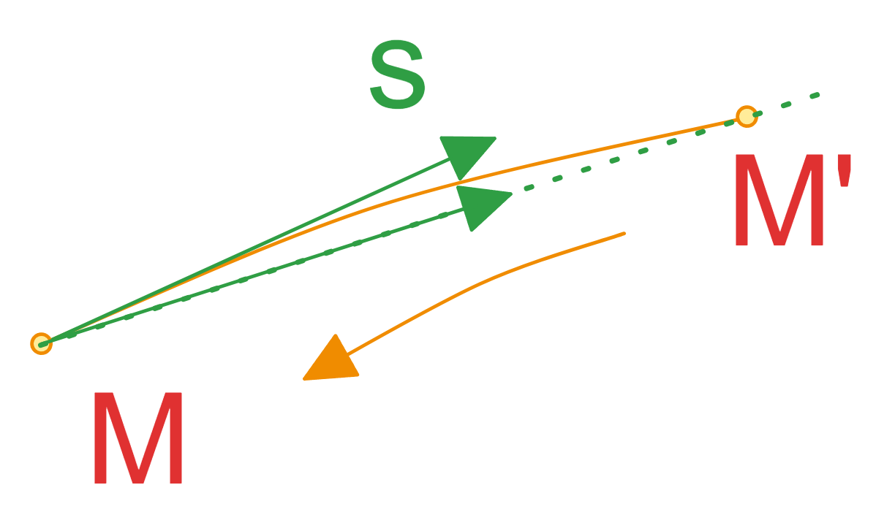
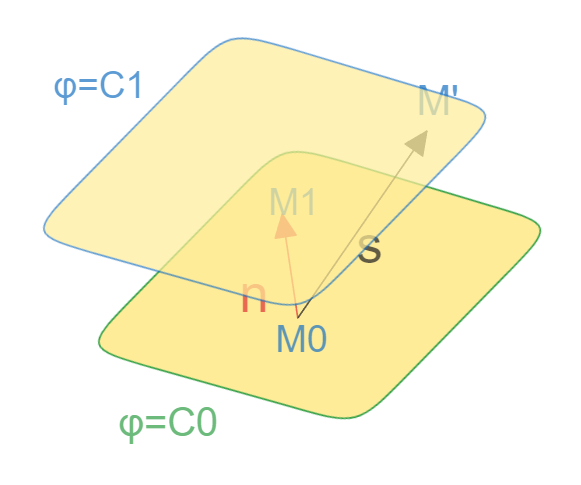
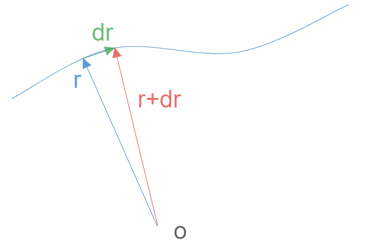
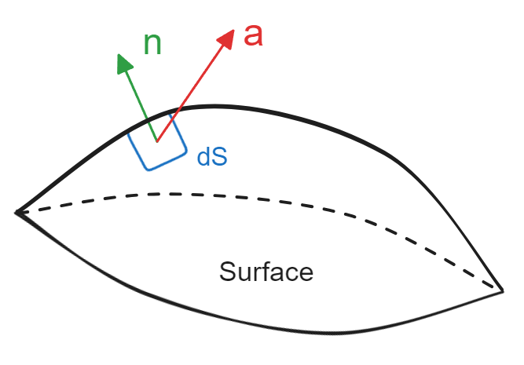
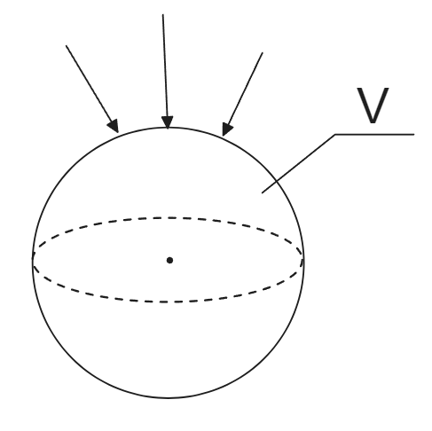
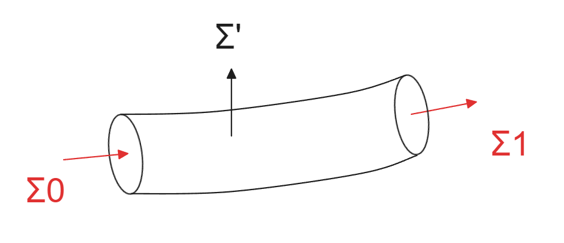
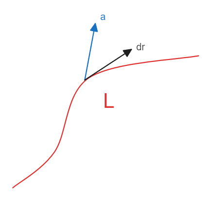

# 流体力学 01 场论基础

## 目标

不可压流体力学解析方面的最终目标为N-S方程
$$
ma=F
\\
\rho\frac{D\vec V}{Dt}=-\nabla p+M\nabla^2\vec v + \rho \vec {b_{f}}
\\
-\nabla p \ \ 压力，
M\nabla^2\vec v \ \  粘性力，
\vec {b_{f}} \ \ 体积力
$$
物质导数
$$
\frac D{Dt} = \frac\part{\part t} + \vec v\cdot \nabla
\\
物质导数=当地导数项+对流导数项
$$

## 场论

### 场定义

场：空间定义的标量或者  $\Phi(\vec r ,t )$ 或者矢量函数  $\vec a(\vec r ,t )$

均匀场 uniform：不依赖位置坐标的场，$\Phi( t )$ ， $\vec a( t )$

定常场 steady：不依赖于时间的场，$\Phi(\vec r  )$ ， $\vec a(\vec r  )$

### 符号定义

### 梯度和方向导数

梯度 gradient： 场的不均匀性度量；

方向导数：$在S方向上，当M’靠近M，得到M点的切向量，公式表达为 \ \lim\limits_{MM'\to 0}\frac{\Phi(M')-\Phi(M)}{MM'}=\frac{\part\Phi}{\part S}$

等值面：

$\vec n 即为 \phi=C_0 等值面的法向$

那么此时使用对法向量n求方向导数
$$
\frac{\part \phi}{\part n}=\lim\limits_{M_1M_0\to 0}\frac{\Phi(M_1)-\Phi(M_0)}{M_1M_0}
$$
如果此时对另一个非法向量求导数则会得到
$$
\frac{\part \phi}{\part s}=\lim\limits_{M'M_0\to 0}\frac{\Phi(M’)-\Phi(M_0)}{M'M_0}
$$
其实可以在图中看到，$M_0M_1$的距离一定小于其他任意的 $M_0M’$，且两个向量有夹角，则$M_0M_1=M_0M'\cos(n,s)$ 

由于$M_1,M'$在等值面上 ， 故有 $\phi(M_1)=\phi(M')$

那么此时将上述两个导数联立：
$$
\frac{\part \phi}{\part s}=
\lim\limits_{M‘M_0\to 0}\frac{\Phi(M’)-\Phi(M_0)}{M'M_0}=
\lim\limits_{M_1M_0\to 0}\frac{\Phi(M_1)-\Phi(M_0)}{M_1M_0}\cos(n,s) =
\frac{\part \phi}{\part n}\cos(n,s)
$$
可见对法向的导数最大 ，且可以推得其他方向导数

那么此时将法向导数大小和单位法向方向称为梯度:
$$
grad\phi=\frac{\part\phi}{\part n}\vec n
$$
那么此时方向导数就可以与梯度互相表达，即为s方向的变化在n方向上的影响力投影
$$
\frac{\part\phi}{\part s} =\frac{\part\phi}{\part n}\vec n\cdot\vec s =\frac{\part \phi}{\part n}\cos(n,s)
$$

#### 哈密顿算子（梯度算子）

$$
\nabla =\vec i \frac\part{\part x}+\vec j \frac\part{\part y}+\vec k \frac\part{\part z}
$$

将梯度写为算子形式
$$
grad\phi=\nabla\phi=
\vec i \frac{\part \phi}{\part x}+\vec j \frac{\part \phi}{\part y}+\vec k \frac{\part \phi}{\part z}
$$

#### 梯度grad 性质

$\nabla\phi=\frac{\part \phi}{\part n}\vec v$表达了，场内变化状况，即不均匀的度量；

$\nabla\phi$ 方向与等值面法线方向一致，且指向增加的方向；大小就是其方向导数；

任意方向导数 $\frac{\part \phi}{\part s}=\nabla\phi\cdot \vec s_0 = grad\phi\cdot\vec s_0=\frac{\part \phi}{\part n}\vec n \cdot\vec s_0$ 

$\nabla\phi$ 方向是$\phi$ 变化最大快的方向

#### 定理 （全微分算子）

$$
d\phi = d\vec r\cdot \nabla \phi
$$

这里有 ，在空间曲线上走过的一小段向量即为dr
$$
d\vec r \cdot \nabla = d
$$

按照全微分的定义
$$
d\phi=\frac{\part \phi}{\part x} dx+\frac{\part \phi}{\part y} dy+\frac{\part \phi}{\part z} dz
$$
然后将小段向量dr对各轴的投影
$$
d\vec r = \vec i dx + \vec j dy +\vec k dz
$$
配合上述梯度定义
$$
\nabla\phi=
\vec i \frac{\part \phi}{\part x}+\vec j \frac{\part \phi}{\part y}+\vec k \frac{\part \phi}{\part z}
$$
得到
$$
d\vec r \cdot \nabla \phi =
\vec i^2 \frac{\part \phi}{\part x} dx+\vec j^2 \frac{\part \phi}{\part y} dy+\vec k^2 \frac{\part \phi}{\part z} dz = 
d\phi
$$

#### 定理

如有 $\vec a = \nabla\phi$ ，则 $\oint_L\vec a\cdot d\vec r =0$

证明：
$$
\oint_L\vec a\cdot d\vec r =
\oint_L \nabla\phi \cdot d\vec r = 
\oint_L d\vec r \cdot \nabla \phi =
\oint_L d \phi = 0
$$
这是符合直觉的，梯度在场内环形轨道环量为零；

### 通量、高斯定理、散度

#### 通量

$\vec n 为单位外法向量 unit-normal-vector$

有一个向量场 $\vec a (\vec r,t)$ 通过一个面上的微元面 $ds$ ，
其中场对该微元面外法线方向的投影为 $a_n=\vec a \cdot \vec n$ ，
那么也就说明 场对于这个整个面的 通量 为 $\iint\limits_S a_n ds$  ;

也就有如下：
$$
\iint\limits_S a_n ds = \iint\limits_S \vec a \cdot \vec n ds= \iint\limits_S \vec a \cdot  d\vec s
$$
这里就相当于将面也作为一个有向面处理，可以试图将**有向微元面**在欧拉系中投影：
$$
d\vec s  \cdot \vec i = ds\cos(\vec n , \vec i ) = dydz
\\
d\vec s  \cdot \vec j = ds\cos(\vec n , \vec j ) = dxdz
\\
d\vec s  \cdot \vec k = ds\cos(\vec n , \vec k ) = dxdy
\\
\cos(\vec n , \vec i ) ，\cos(\vec n , \vec j )， \cos(\vec n , \vec k )  为方向余弦
$$
 

#### 散度

有一个封闭面V，场对于这个面的整体影响为 ：
$$
\oiint\limits_s a_nds=\oiint\limits_s \vec a \cdot \vec n ds
$$

 散度即为当这个封闭面体积缩小后整个场对于面的影响，其实就是场影响单位体积，即影响均值 ：
$$
div\vec a=\lim\limits_{V\to0}\frac{\oiint\limits_S\vec a \cdot\vec nds}V
$$
这里引入奥高公式（高斯公式）:
$$
\oiint\limits_s \vec a \cdot \vec n ds=\oiint\limits_s \vec n \cdot \vec a ds = \iiint\limits_V\nabla\cdot \vec a dV
\\
div\vec a = \nabla\cdot \vec a = \frac{\part a_x}{\part x}+ \frac{\part a_y}{\part y}+ \frac{\part a_z}{\part z}
$$
由此已经得到了散度

#### 无源场、管形场

$$
\oiint\limits_Sa_nds=0
\\
\oiint\limits_S a_n ds=\oiint\limits_S \vec n \cdot \vec a ds= \iiint\limits_V\nabla \cdot \vec a dV =0
\\
\nabla \cdot \vec a =0
$$

一个封闭曲面没有通量，就说明内部 没有进出的源头； 那么 散度为0的场就是无源场；

管型场

流入和流出是等量的，侧面并没有出入；

### 环量、旋度、stokes定理

#### 环量

从路径积分开始看，当场在路径微元dr上投影，并将其沿着路径积分，当然如果是封闭的 就是环路积分
$$
\int\limits_L \vec a  \cdot d\vec r
\\
\oint\limits_L \vec a  \cdot d\vec r
$$

#### 旋度

首先看旋度在n方向的投影
$$
rot_n\vec a=\lim\limits_{s\to0}\frac{\oint\limits_L \vec a  \cdot d\vec r}s
$$
引入斯托克斯公式
$$
\oint\limits_L \vec a  \cdot d\vec r 
\\
=\oiint\limits_s
[
(\frac{\part a_z}{\part y}-\frac{\part a_y}{\part z})\cos(n,x)+
(\frac{\part a_x}{\part z}-\frac{\part a_z}{\part x})\cos(n,y)+
(\frac{\part a_y}{\part x}-\frac{\part a_x}{\part y})\cos(n,z)
]
ds
\\
=\oiint\limits_s
[
(\frac{\part a_z}{\part y}-\frac{\part a_y}{\part z})dydz+
(\frac{\part a_x}{\part z}-\frac{\part a_z}{\part x})dxdz+
(\frac{\part a_y}{\part x}-\frac{\part a_x}{\part y})dxdy
]
ds
$$
根据旋度的投影
$$
rot_n\vec a
= rot\vec a \cdot \vec n
=\lim\limits_{s\to0} \frac{\oint\limits_L \vec a  \cdot d\vec r} s 
\\=
\lim\limits_{s\to0} \frac{\oiint\limits_s
[
(\frac{\part a_z}{\part y}-\frac{\part a_y}{\part z})\cos(n,x)+
(\frac{\part a_x}{\part z}-\frac{\part a_z}{\part x})\cos(n,y)+
(\frac{\part a_y}{\part x}-\frac{\part a_x}{\part y})\cos(n,z)
]
ds} s 
\\=
(\frac{\part a_z}{\part y}-\frac{\part a_y}{\part z})\cos(n,x)+
(\frac{\part a_x}{\part z}-\frac{\part a_z}{\part x})\cos(n,y)+
(\frac{\part a_y}{\part x}-\frac{\part a_x}{\part y})\cos(n,z)
\\ 
\Rightarrow
\\
rot\vec a
=
\vec i(\frac{\part a_z}{\part y}-\frac{\part a_y}{\part z}) +
\vec j(\frac{\part a_x}{\part z}-\frac{\part a_z}{\part x}) +
\vec k(\frac{\part a_y}{\part x}-\frac{\part a_x}{\part y})
=\nabla \times\vec a
$$
那么得到了旋度的定义式：
$$
rot\vec a = \nabla\times \vec a = 
\left |\begin{matrix}
\vec i & \vec j & \vec k   \\
\frac{\part}{\part x} & \frac{\part}{\part y}  & \frac{\part}{\part z}    \\
a_x & a_y & a_z   \\ 
\end {matrix}\right |
$$

#### 无旋场

$$
rot\vec a=\vec 0
\\
\oint\limits_L \vec a  \cdot d\vec r =\iint\limits_s rot\vec a \cdot \vec n ds=0
$$

其实一句梯度中的一个定理  ： 如有 $\vec a = \nabla\phi$ ，则 $\oint_L\vec a\cdot d\vec r =0$  ， 可见两者等同，一个标量 $\phi$ 组成的梯度场 $\nabla\phi$ ，其环量必定为零；

**一个标量场的梯度的旋度一定为零**
$$
\nabla\times\nabla\phi =\vec 0
$$

### 梯度、散度、旋度总结

梯度   矢量
$$
grad\phi=\nabla\phi = \vec i\frac{\part\phi}{\part x}+\vec j\frac{\part\phi}{\part y}+\vec k\frac{\part\phi}{\part z}
$$
散度   标量
$$
div\vec a = \nabla\cdot \vec a = \frac{\part a_x}{\part x}+\frac{\part a_y}{\part y}+\frac{\part a_z}{\part z}
$$
旋度  矢量
$$
rot\vec a
=
\nabla\times\vec a  
= 
\left |\begin{matrix}
\vec i & \vec j & \vec k   \\
\frac{\part}{\part x} & \frac{\part}{\part y}  & \frac{\part}{\part z}    \\
a_x & a_y & a_z   \\ 
\end {matrix}\right |
$$

### 拉普拉斯算子

$$
\Delta=\nabla^2=\nabla\cdot\nabla=\frac{\part^2}{\part x^2}+\frac{\part^2}{\part y^2}+\frac{\part^2}{\part z^2}
$$
若满足 $\Delta\phi=\nabla^2\phi=0$ , 则称 $ \phi$ 为调和函数 ，因为  $\nabla^2$ 也叫调和算子 Harmonic

### 场论重要结论

**一个标量场的梯度的旋度一定为零向量**
$$
\nabla\times\nabla\phi =\vec 0
$$
**一个向量的旋度的散度为零**
$$
\nabla\cdot(\nabla\times \vec a)=0
$$

## 参考书

北大 吴望一《流体力学》

重庆大学 《矢量分析与场论》

西安交大 《复变函数》

东南大学《积分变换》

东南大学《数理方程与特殊函数》

