# 流体力学-01-流体性质和流体分类

[TOC]

## 科普

一般是指的气体或液体

流体无法抵抗剪切力

## 流体基本性质

### 密度和比重

密度 即单位体积所含质量
$$
密度\rho=\frac MV = \frac{质量}{体积} =\frac{[kg]}{[m^3]}
$$
比容 即单位质量所占体积  specific volume
$$
比容 = v=\frac{V}{M} = \frac{体积}{质量}=\frac{{m^3}}{[kg]}
$$
比重 某密度在某重力中的值 specific weight
$$
\Gamma=\frac G V = \frac{Mg}{V}=\rho g = \frac{[Pa]}{[m]}
$$
标准水重比（这个翻译为【比重】并不合适，可翻译为重度） 就是和一个大气压下4摄氏度的标准水的重量之比
$$
\frac{\rho}{\rho_{water}} = \frac{\Gamma}{\Gamma_{water}}
$$
常用量
$$
水water : 4^oC,1atm\to\rho_{water}=1000kg/m^3
\\
空气air : 1atm \to 1.2kg/m^3
$$

### 动力黏粘度和运动黏粘度 viscosity  kinematic

牛顿粘度实验，这种流动称为库埃特流动

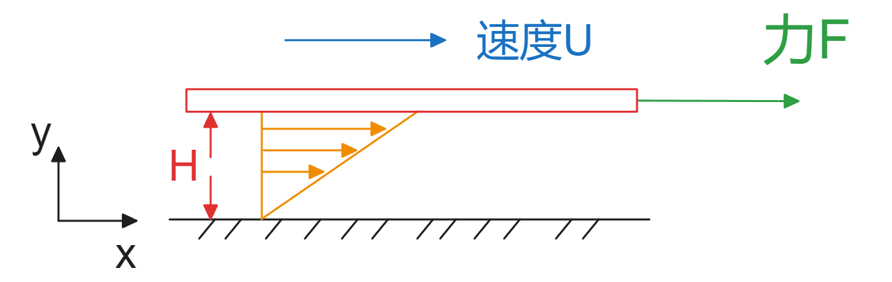
$$
F=\mu A\frac{du}{dy}
\\
那么单位面积上的力为：
\tau = \mu \frac{du}{dy}
$$
这个是牛顿粘性定律

#### 剪切应变率

如图

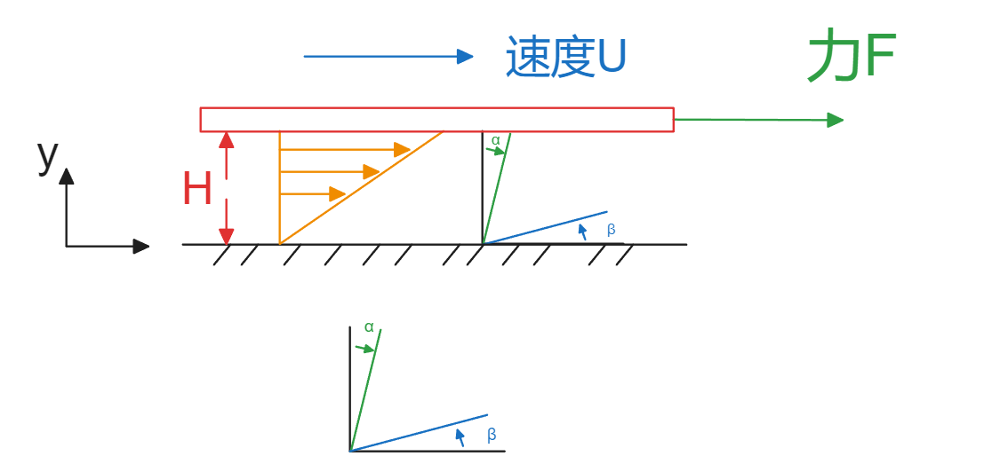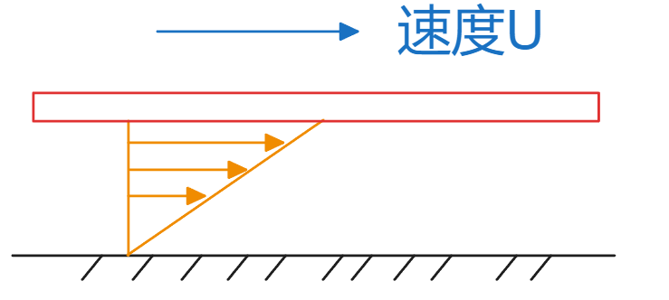

选择正交的两个流线，随时间变化，两个流体线会角度减小，设减小量为正， $\alpha , \beta$
那么单位时间内的两个角度减小量就是剪切应变率 

$\alpha+\beta$

再次看图，牛顿实验中的 $\beta$ 没有变化，所以就只考虑 $\alpha$

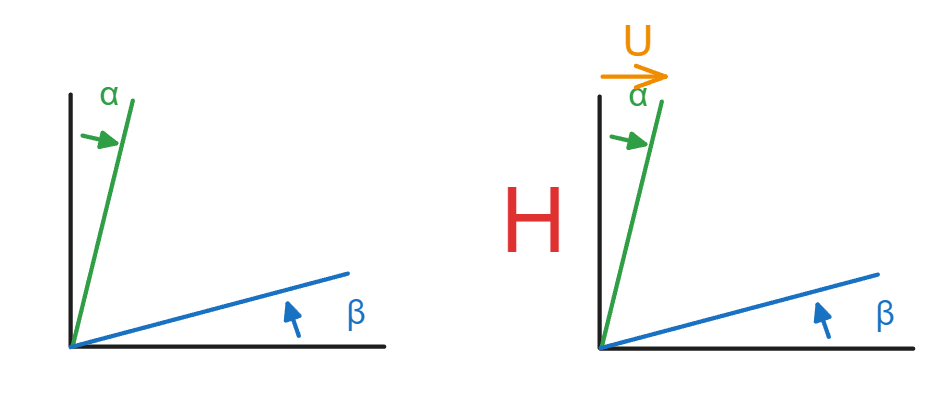

$$
\tan\alpha = \frac UH \approx \alpha
$$
那么【剪切应变率】在单位时间内表达为；
【剪切应变率】是个无量纲数；
$$
\dot \Gamma = \frac{du}{dy}，该剪切应变率仅支持牛顿粘性实验
$$
所以针对牛顿实验的剪切应变率就是这样的；

此时粘性力就表达为【应力】和【应变率】之间的关系
$$
\tau = \mu \dot \Gamma_{xy}
\\
\tau -- [帕Pa]
\\
\mu -- [帕Pa\cdot 秒s]
$$
相比较材料力学 很相似
$$
\sigma = E\varepsilon 
\\
应力=杨氏模量*应变
$$

$$
\bar c = G \Gamma
\\
剪切应变 = 剪切模量*角应变
$$

运动粘性，从量纲就能看出来和运动单位有关
$$
\nu=\frac \mu \rho
\\
\nu -- [平米m^2 / 秒s]
\\
\mu -- [帕Pa\cdot 秒s]
$$

#### 库埃特Couette 流动

下图都表达为库埃特流动

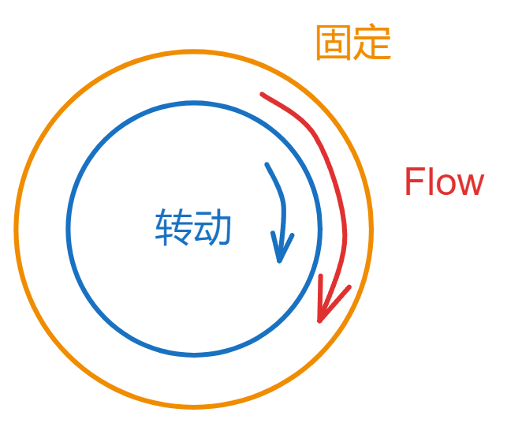

#### 泊肃叶 Poiseuille流动

人类血管里的流动，压差驱动的流动

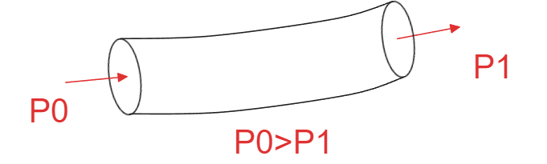

#### 常见流体粘性

1atm，20摄氏度,动力粘度

| 种类     | 动力粘度（Pa s）     |
| -------- | -------------------- |
| 水       | $100.2\times10^{-3}$ |
| 乙醇     | $119.7\times10^{-3}$ |
| 水银     | $156\times10^{-3}$   |
| 干燥空气 | $1.82\times10^{-3}$  |
| 二氧化碳 | $1.47\times10^{-3}$  |

水和空气的运动粘度

| 种类         | 运动粘度$（m^2/s）$  |
| ------------ | -------------------- |
| 水0摄氏度    | $1.792\times10^{-6}$ |
| 水20摄氏度   | $1.004\times10^{-6}$ |
| 空气0摄氏度  | $13.22\times10^{-6}$ |
| 空气20摄氏度 | $15.01\times10^{-6}$ |
|              |                      |

### 体弹性模量和压缩量

一个立方体从各处受到压力

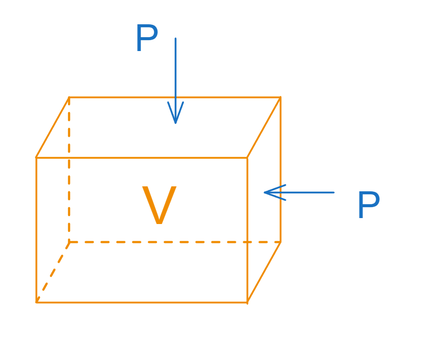

定义关系为
$$
\Delta P = -K\frac{\Delta V}V
\\
K=\frac{\Delta P}{-\frac{\Delta V}{V}}=\frac{\Delta P}{ \frac {\Delta\rho}\rho}=\rho\frac{\part P}{\part \rho}
\\
K[Pa]--体弹性模量，对于气体，体弹性模量需要提及等温或等熵情况；
$$
于是定义压缩率
$$
\beta=\frac1K
$$

#### 声速

等熵绝热时，压力对密度偏导，开方；
$$
a=\sqrt{ \frac{\part P}{\part \rho} |_s}=\sqrt{\frac{K}{\rho}|_s}
\\
a_{air}=340m/s,1atm,290K
\\
a_{water}=1450m/s
$$

#### 振动

杆件的纵向振动，杆件中的声速
$$
a_杆=\sqrt{\frac E{\rho_L}}
\\
\rho_L 为线密度
$$

### 表面张力

#### 定义

表面张力液体与其他液体或气体接触时，会有趋于收缩的力；表面张力定义为单位长度的力；

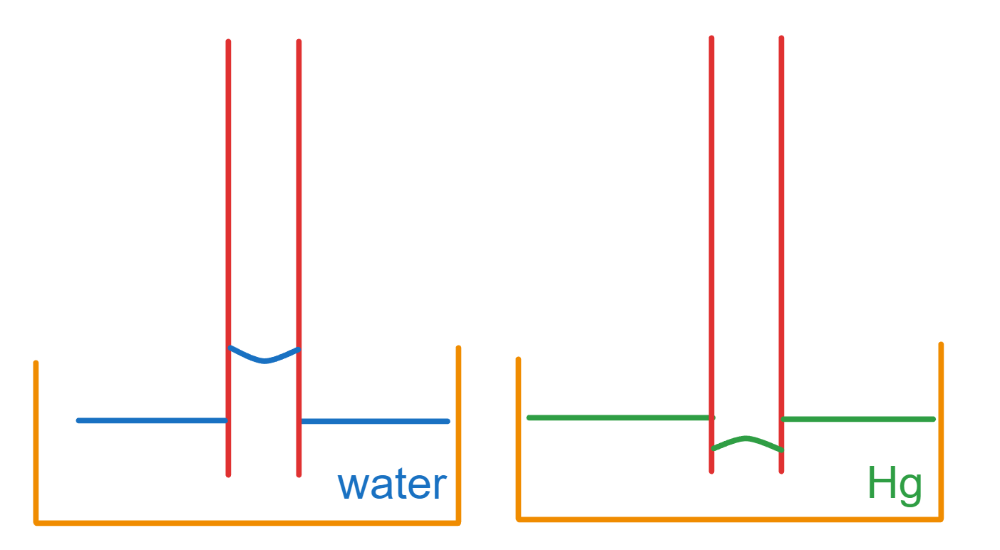

原型肥皂泡的形成也是张力导致，其液面张力内外都和空气接触，所以两侧都要计算张力；

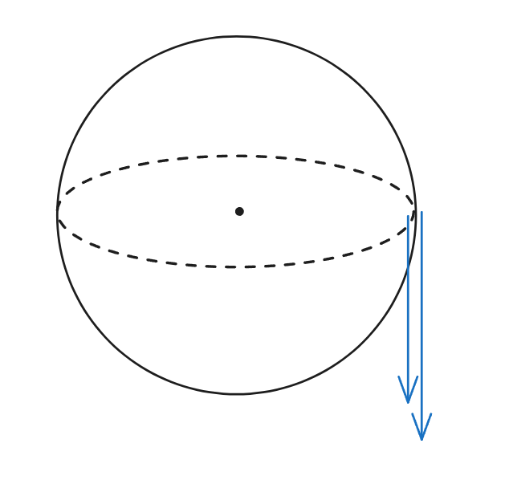

#### 张力测量

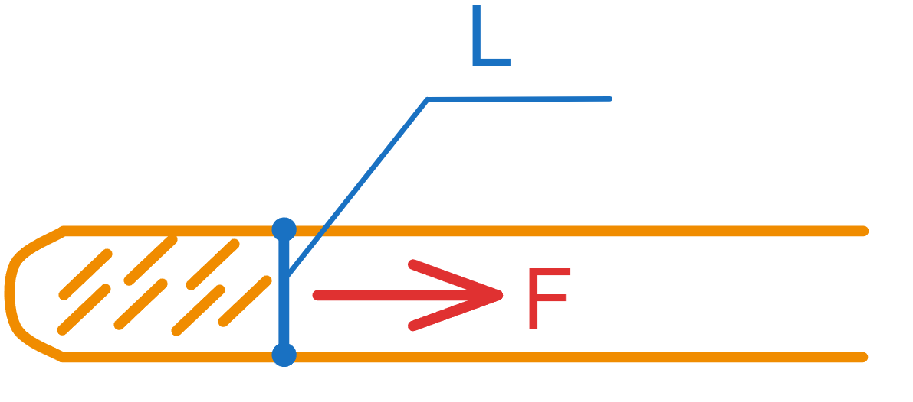

仪器肥皂液面在某气体或者液体中，保持蓝色薄膜维持直线时需要施加的力；
薄膜两侧都和被测者接触，即 F=2TL

#### 管内水柱

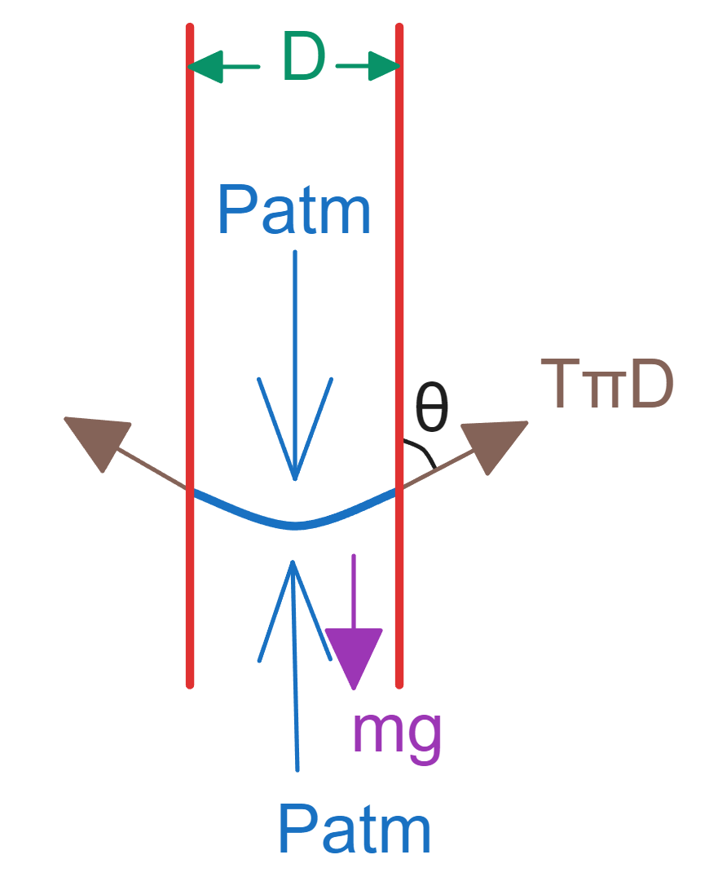
$$
mg=T\pi D\cos\theta
\\
\rho\frac\pi4D^2hg=T\pi D\cos\theta
$$

## 流体分类（流动分类）

### 粘性和非粘性  viscous and inviscid

非粘性就是无粘流体，粘性系数为零 $\mu=0$
有粘性就是有粘流体，粘性系数非零 $\mu\neq0$

### 边界层

普朗特边界层 Prandtl
$$
根据粘性公式 \tau = \mu\frac{du}{dy}
\\
边界层处由于粘性存在,在很小的区间内会有很大的速度差，导致\frac{du}{dy}非常大，因此边界层需要考虑粘性
\\
而主流中各处速度大致均等，\frac{du}{dy}几乎为零，因此主流中反而不考虑粘性项
$$

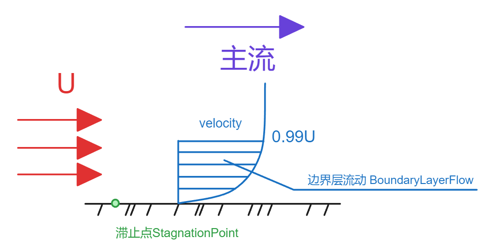

### 雷诺数

一个无量纲的量，刻画惯性力和粘性力的度量  	Reynolds；
雷诺数越大可以视作惯性力越大，流体越是可看作无粘流动，惯性大也会导致紊流；
$$
Re=\frac{\rho UL}\mu = \frac{UL}\nu
\\
\nu--运动粘度
\\
\mu--动力粘度
$$
在小型风洞实验中无法将整机1:1模拟实验时，会进行模型的缩放，此时需要保证和实际工况的雷诺数相同才可以；

### 牛顿流体和非牛顿流体

满足库尔特流动的是Newton牛顿流体
$$
 \tau = \mu\frac{du}{dy}=\mu\dot\Gamma
$$

#### 非牛顿流体

Bingham流体：奶油，果冻

塑性流体：沥青

拟塑性流体：生鸡蛋，血液 $\frac{dy}{dy}\uparrow , \mu\downarrow $

膨胀流体：泥潭  $\frac{dy}{dy}\uparrow , \mu\uparrow,\tau\uparrow  $

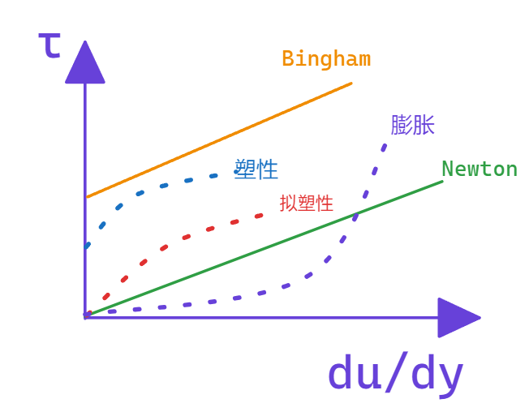

### 可压不可压

若密度不变，则比容不变，即为不可压 incompressible

####  马赫数 MachNumber

流体的速度和声速之比
$$
Ma=\frac Ua
$$
一般来说 ，流体流动时 $Ma<0.3$ 时，密度变化仅0.2，视作为不可压  ；0.3以上则为可压缩；
高铁速度为350KM/H，速度接近0.3声速，但依然没有达标作为不可压；

$Ma>1$ 超声速 SuperSonic
$Ma<1$ 亚声速 SubSonic
$Ma \simeq 1$ 跨声速 TransSonic

东风47导弹Ma=18

### 理想流体 ideal fluid

不可压，无粘的流体，不考虑传热；

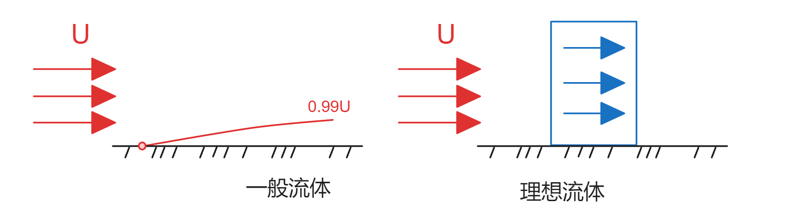

一般牛顿流体的主流部分可以视作理想流体；

## 单位和量纲

量纲就是物理量 Dimension 维度

单位就是赋予数字大小的物理量； 

### 基本量纲

| 基本量纲 | 单位 |
| -------- | ---- |
| 质量M    | kg   |
| 时间T    | s    |
| 长度L    | m    |
| 电流     | A    |
| 温度     | K    |
| 物质量   | mol  |
| 坎德拉   | cd   |

### 导出量纲

| 导出量纲 | 单位                                    |      |
| -------- | --------------------------------------- | ---- |
| 速度v    | $v=m/s$                                 |      |
| 力N      | $N=\frac{kg\cdot m}{s^2}$               |      |
| 压力P    | $Pa=\frac N{m^2}=\frac{kg}{m\cdot s^2}$ |      |
|          |                                         |      |

### 量纲分析

量纲分析就是：导出无量纲量

 白金汉π定理   Buckingham π 定理
$$
当实验中有n个物理量 f(A_1,A_2,A_3 ...)=0 ,涉及m个基本量纲
\\
则将实验简化为（n-m）个无量纲量\pi_1,\pi_2,...,\pi_{n-m}表达，F(\pi_1,\pi_2,...,\pi_{n-m})=0
$$

#### 例

$$
在密度为\rho、运动粘度为\nu、的流体当中，直径为d的小球以U的速度运动（图1.20）。
\\小球受到的来自流体的阻力为F。
\\通过与此现象相关的5个物理量\rho、\nu、d、U、F，求出元数。
$$

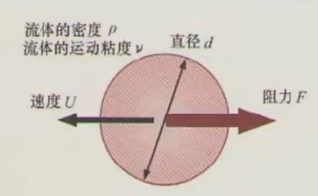

采用循环变量法 repeating-variable-method
$$
\rho、\nu、d、U、F
\\
力学范畴有三个基本量纲，那么就挑选三个较为简单的量纲  
\rho、U、d
\\
剩下的量纲用挑选的量纲组合
\\
\nu： \rho^\alpha U^\beta d^\gamma \nu
\\
量纲分析：长度[L]=-3\alpha+\beta+\gamma+2=0\\
质量[M]=\alpha=0\\
时间[T]=-\beta-1=0
\\
求得 \alpha=0,\beta=-1,\gamma=-1
\\
\pi_1= U^{-1} d^{-1} \nu,即为雷诺数的倒数
\\
同理处理F，得到\pi_2= \rho^{-1}U^{-2} d^{-2} F,这个是阻力系数
$$

