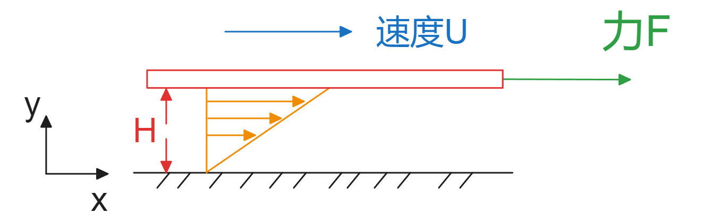
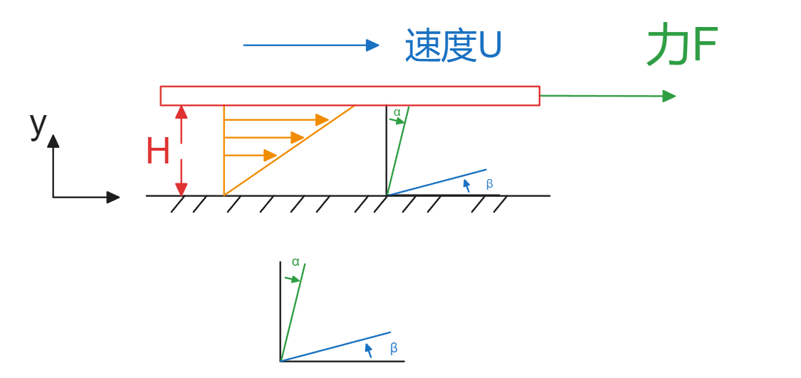
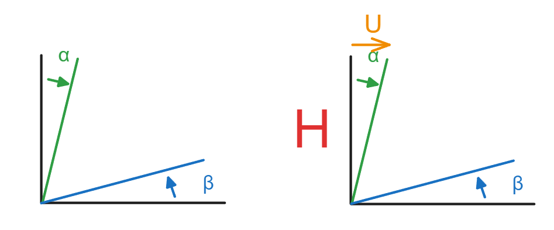
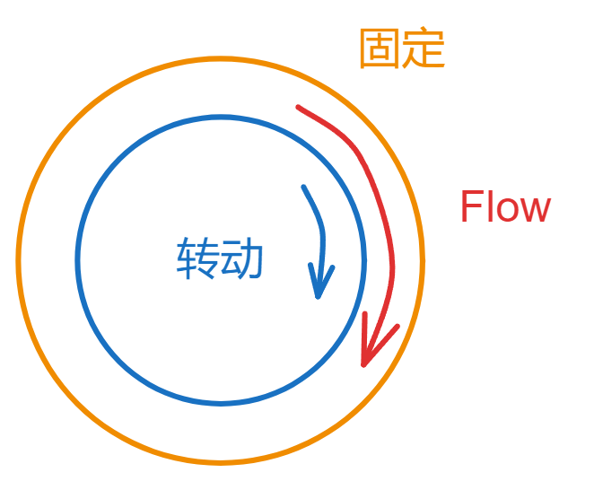

# 流体力学-02-流体性质和流体分类

## 科普

略

## 流体基本性质

### 密度和比重

密度 即单位体积所含质量
$$
密度\rho=\frac MV = \frac{质量}{体积} =\frac{[kg]}{[m^3]}
$$
比容 即单位质量所占体积  specific volume
$$
比容 = v=\frac{V}{M} = \frac{体积}{质量}=\frac{{m^3}}{[kg]}
$$
比重 某密度在某重力中的值 specific weight
$$
\Gamma=\frac G V = \frac{Mg}{V}=\rho g = \frac{[Pa]}{[m]}
$$
标准水重比（这个翻译为【比重】并不合适，可翻译为重度） 就是和一个大气压下4摄氏度的标准水的重量之比
$$
\frac{\rho}{\rho_{water}} = \frac{\Gamma}{\Gamma_{water}}
$$
常用量
$$
水water : 4^oC,1atm\to\rho_{water}=1000kg/m^3
\\
空气air : 1atm \to 1.2kg/m^3
$$

### 动力黏粘度和运动黏粘度 viscosity  kinematic

牛顿粘度实验，这种流动称为库埃特流动

$$
F=\mu A\frac{du}{dy}
\\
那么单位面积上的力为：
\tau = \mu \frac{du}{dy}
$$
这个是牛顿粘性定律

#### 剪切应变率

如图

选择正交的两个流线，随时间变化，两个流体线会角度减小，设减小量为正， $\alpha , \beta$
那么单位时间内的两个角度减小量就是剪切应变率 

$\alpha+\beta$

再次看图，牛顿实验中的 $\beta$ 没有变化，所以就只考虑 $\alpha$

$$
\tan\alpha = \frac UH \approx \alpha
$$
那么【剪切应变率】在单位时间内表达为；
【剪切应变率】是个无量纲数；
$$
\dot \Gamma = \frac{du}{dy}，该剪切应变率仅支持牛顿粘性实验
$$
所以针对牛顿实验的剪切应变率就是这样的；

此时粘性力就表达为【应力】和【应变率】之间的关系
$$
\tau = \mu \dot \Gamma_{xy}
\\
\tau -- [帕Pa]
\\
\mu -- [帕Pa\cdot 秒s]
$$
相比较材料力学 很相似
$$
\sigma = E\varepsilon 
\\
应力=杨氏模量*应变
$$

$$
\bar c = G \Gamma
\\
剪切应变 = 剪切模量*角应变
$$

运动粘性，从量纲就能看出来和运动单位有关
$$
\nu=\frac \mu \rho
\\
\nu -- [平米m^2 / 秒s]
\\
\mu -- [帕Pa\cdot 秒s]
$$

#### 库埃特Couette 流动

下图都表达为库埃特流动

#### 泊肃叶 Poiseuille流动

人类血管里的流动，压差驱动的流动

#### 常见流体粘性

1atm，20摄氏度,动力粘度

| 种类     | 动力粘度（Pa s）     |
| -------- | -------------------- |
| 水       | $100.2\times10^{-3}$ |
| 乙醇     | $119.7\times10^{-3}$ |
| 水银     | $156\times10^{-3}$   |
| 干燥空气 | $1.82\times10^{-3}$  |
| 二氧化碳 | $1.47\times10^{-3}$  |

水和空气的运动粘度

| 种类         | 运动粘度$（m^2/s）$  |
| ------------ | -------------------- |
| 水0摄氏度    | $1.792\times10^{-6}$ |
| 水20摄氏度   | $1.004\times10^{-6}$ |
| 空气0摄氏度  | $13.22\times10^{-6}$ |
| 空气20摄氏度 | $15.01\times10^{-6}$ |
|              |                      |

### 体弹性模量和压缩量

