# 流体力学-02-流体运动学基础

[TOC]

## 表征流体流动的物理量

速度：单位时间内位置向量改变, $\vec v = \frac{dr}{dt}$

体积流量： 单位时间内流过单位面积法向的物质体积，$Q=\iint_A\vec v\cdot \vec n dA$

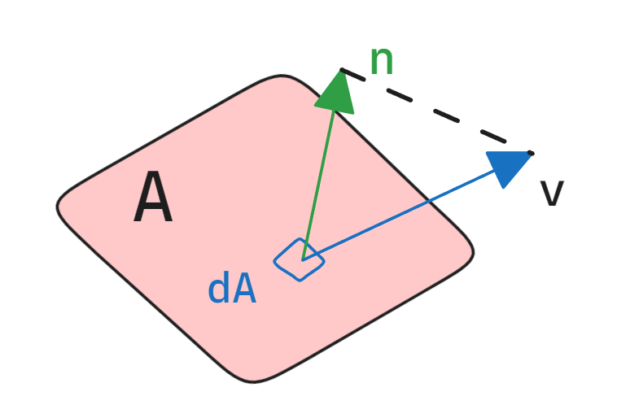

工程流量一般不用微积分，直接乘法即可：$VA$

质量流量：体积流量引入密度即可 $\dot m=\rho\iint_A\vec v\cdot \vec n dA$ ,，工程中即为 $\rho VA$

## 拉格朗日Lagrange描述、欧拉Euler描述

拉格朗日Lagrange描述,观察者跟随质点
$$
\vec r (t;x_0,y_x,z_0,t_0)
\\
\vec v=\frac{d\vec r}{dt}
\\
\vec a=\frac{d^2\vec r}{dt^2}
$$

欧拉Euler描述，固定观察者位置  x y z
$$
\vec v(x,y,z,t)
$$
此时的加速度较为麻烦

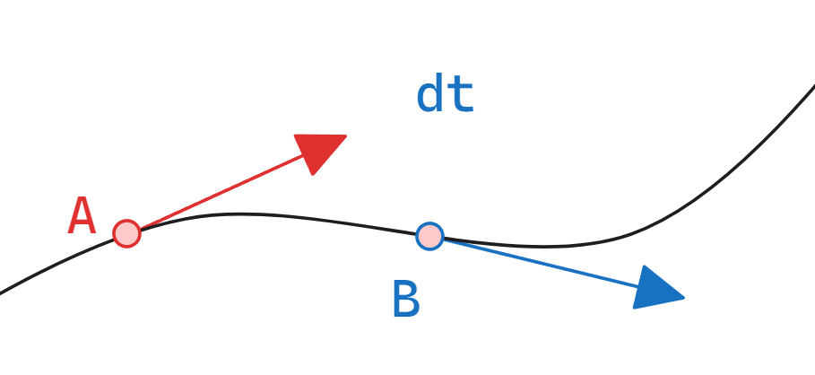
$$
A点速度:\vec v_A(x,y,z,t)
\\
AB长度L_{AB}:\vec vdt=\vec i u dt+\vec j v dt + \vec k w dt
\\
B点速度:\vec v_B(x+udt,y+vdt,z+wdt,t+dt)
\\
\vec a=\lim\limits_{t\to0}\frac{\vec v_A-\vec v_B}{dt}=
\frac{\part \vec v}{\part x}u+\frac{\part \vec v}{\part y}v+\frac{\part \vec v}{\part z}w+\frac{\part \vec v}{\part t}=
\vec v\cdot\nabla \vec v+\frac{\part \vec v}{\part t}
 
$$

一般来说速度的梯度 $ \nabla \vec v$ 是二阶张量，当然 $(\vec v\cdot \nabla)\vec v$ 这样看就是标量和矢量计算；
$$
\vec v\cdot\nabla \vec v+\frac{\part \vec v}{\part t}
=
(\vec v\cdot\nabla+\frac{\part  }{\part t}) \vec v 
=
\frac{D}{Dt}\vec v
\\
\frac{D}{Dt}=\vec v\cdot\nabla+\frac{\part  }{\part t}  称为为物质导数、随体导数
$$
欧拉描述下，质点在移动后由不同两个观察者记录状态，若要描述质点的状态，
则把空间位置变动引起的变化和对时间的偏导都记录下来，就得到可描述质点的方式，即物质导数、随体导数；
$$
\frac{\part}{\part t}  当地导数
\\
\frac{\part \vec v}{\part t}  当地加速度
\\
\vec v\cdot\nabla对流导数
\\
\vec v\cdot\nabla \vec v对流加速度
$$
当地加速度描述场的定常性，毕竟定常的场不随时间变化，当地加速度也就是0；

对流加速度描述场的均匀性，场中不同位置的微元物理量不同，对流加速度也就非零；

### 流体加速度

$$
\\
\vec a = \frac{D\vec v}{Dt} =
\frac{\part \vec v}{\part t}+\vec v\cdot\nabla\vec v=
\frac{\part \vec v}{\part t}+ u\frac{\part \vec v}{\part x}+v\frac{\part \vec v}{\part y}+w\frac{\part \vec v}{\part z}
$$

物质导数相当于在欧拉描述和拉格朗日描述之间提供了转换；
物理定律在L描述中针对物体，但是对于在欧拉时空考察中想要使用物理定律，则使用物质导数转换；

欧拉描述中【位置】和【时间】之间是独立的；

### 压力和切应力（法向应力和切向应力）

### 法相应力：单位面积的法向力；

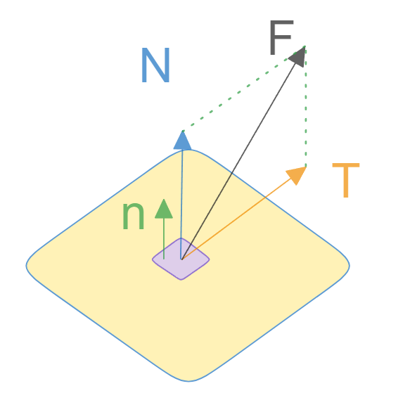
$$
\delta N = \delta F\cdot \vec n
\\
法向应力：\sigma = \frac{\delta N}{\delta A},\delta A\to0
\\
切向应力：\tau=\frac{\delta T}{\delta A},\delta A\to0
$$

### 应力张量stress tensor

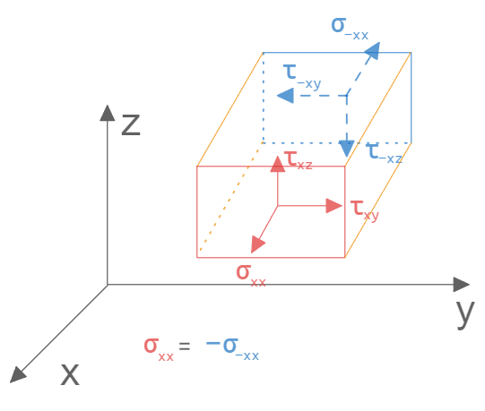

直接考察空间立方体受力，前后面的应力，下表第1位为受力面的法向轴，第2位为该应力朝向轴；于是整体得到一个应力张量矩阵；
$$
\bar{\bar{\sigma}}
=
\left[
\begin{matrix}
\sigma_{xx} & \tau_{xy} &\tau_{xz} \\
\tau_{yx} & \sigma_{yy} &\tau_{yz} \\
\tau_{zx} & \tau_{zy} &\sigma_{zz} \\
\end{matrix}
\right]
$$
这个就是二阶应力张量；由于切向力平衡就导致该矩阵是对称矩阵 $\tau_{xy}=\tau_{yx}$，有很不错的性质；

在静力平衡中立方体受到向内的压力，并和应力张量叠加，得到偏应力张量；
$$
\left[
\begin{matrix}
-p &  0 & 0 \\
0  & -p & 0 \\
0  &  0 &-p \\
\end{matrix}
\right]
=
-p\bar{\bar{I}}
\\
\bar{\bar{\tau}}=\bar{\bar{\sigma}}-p\bar{\bar{I}}
$$

#### 柯西定理

来自弹性力学，一个单位面的受力为其二阶张量和其面法向的点乘
$$
\vec F=\bar{\bar{\sigma}}\cdot \vec n
\\
外法线 \vec n 的单位面积上的力
\\
\vec F_A=\bar{\bar{\sigma}}\cdot \vec ndA
$$

### 流线、迹线、脉线

#### 流线

流线stream line：欧拉描述下，场中的一条曲线，任何一点的切线方向就是速度方向，该曲线为流线

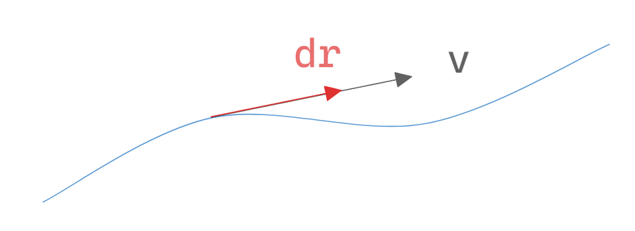
$$
d\vec r || \vec v
\\
\frac{dx}u = \frac{dy}v = \frac{dz}w  
$$
 例
$$
若场中的参数为 u=-Ay , v=Ax,求处其流线方程：
\\
\frac{dx}u=\frac{dy}v = \frac{dx}{-Ay}=\frac{dy}{Ax}
\\
\int Axdx=-\int Aydy
\\
x^2+y^2=\tilde e
 流线 方程是个圆
$$

#### 迹线

迹线path line：拉格朗日描述下，位置和时间有关，随着时间过去走过的位置就是迹线；

这里直接使用例题解释
$$
假设拉格朗日视角下，流场有u=Ay,v=-Ax,质点走过的微元路径为\frac{d\vec r},速度为\frac{d\vec r}{dt}=\vec v，求迹线方程；
\\
\frac{d x}{dt}=u=Ay,\frac{d y}{dt}=v=-Ax
\\
接下来解微分方程
\\
\frac{d^2 x}{dt^2}=A\frac{d y}{dt}=-A^2x\to x''+A^2x=0
\\
显然是齐次常微分方程，采用特征值方法解
$$

#### 脉线

染色线 streak line 和迹线差不多

同一个点不同时间放出颜色流体，其根据迹线染色出来的曲线就为脉线；

## 流体的运动和变形描述

平动(线运动)和线变形

平动：略

#### 线变形，涉及应变率

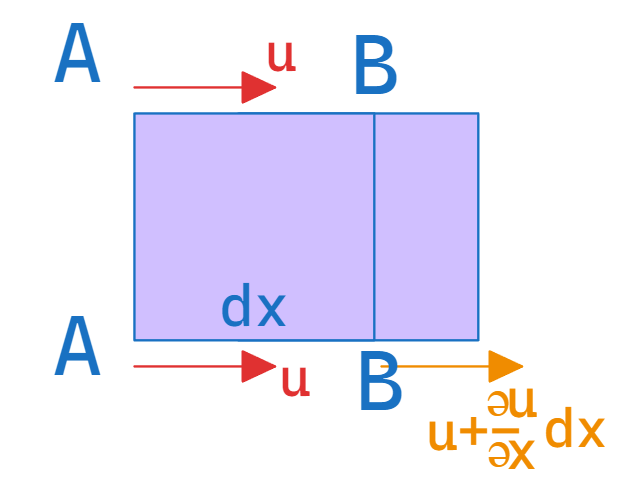

如图，纵向均匀场但横向不均匀的场，横向位置的速度不同，那么其经过dt时间的变化距离即可得到，那么对单位时间内和应变长度和原长度dx比就可得到单位时间的应变率；
$$
\vec v_A=u
\\
\vec v_B=u+\frac{\part u}{\part x}dx
\\
\delta L=\vec v_Bdt-\vec v_Adt = \frac{\part u}{\part x}dxdt
\\
\varepsilon_x=\frac{\frac{\part u}{\part x}dxdt}{dx}=\varepsilon_x=\frac{\part u}{\part x}dt
\\
\dot\varepsilon_x=\frac{\varepsilon_x}{dt}=\frac{\part u}{\part x}
\\
\dot\varepsilon_x=\frac{\part u}{\part x}---x方向流体单位时间线应变率
$$

#### 线应变率

$$
\dot\varepsilon_x=\frac{\part u}{\part x}
\\
\dot\varepsilon_y=\frac{\part v}{\part y}
\\
\dot\varepsilon_z=\frac{\part w}{\part z}
$$

#### 体应变率

速度的散度就是体应变率
$$
\frac{\delta(dV)}{dV\cdot dt} = \frac{du}{dt}+ \frac{dv}{dt}+ \frac{dw}{dt} =\nabla \cdot \vec v
$$
注意：不可压流体的散度为零

#### 旋转角运动和角应变率

一个旋转的场内

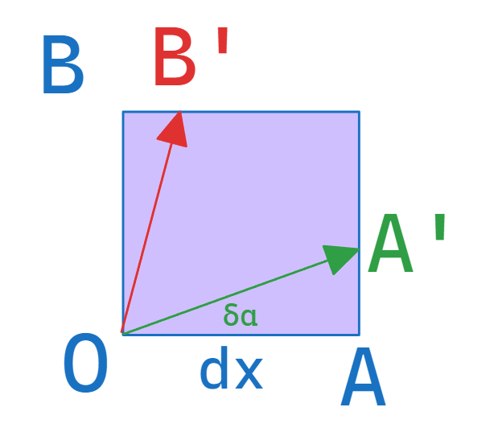

，质点从O点经过dx后变化到A'位置，其y向速度分量v因为dx而发生变化所以这里有个交叉求导
$$
\vec v=\frac{\part v}{\part x}dx
\\
\delta\alpha \sim 0\to\delta\alpha =\tan\delta\alpha
\\
\tan\delta\alpha=\frac{AA'}{OA}=\frac{\part v}{\part x}dxdt/dx=\frac{\part v}{\part x}dt
\\
\delta\alpha=\frac{\part v}{\part x}dt
\\
\delta\beta=\frac{\part u}{\part y}dt
$$
故角速度即为  如下（其实是旋度的一半）
$$
\Omega_z=\frac12(\frac{\part v}{\part x}-\frac{\part u}{\part y})
\\
\Omega_y=\frac12(\frac{\part u}{\part z}-\frac{\part w}{\part x})
\\
\Omega_x=\frac12(\frac{\part w}{\part y}-\frac{\part v}{\part z})
\\
\Omega = i\Omega_x+j\Omega_y+k\Omega_z =  \frac12 \nabla\times \vec v
\\
\omega=\nabla\times \vec v --- 旋度、涡量 vorticity
$$
角应变率（剪切变形率）

即单位时间内90角度的减小量
$$
\dot\Gamma_{xy}=
\frac{\delta\alpha+\delta\beta}{dt}=
\frac{\frac{\part v}{\part x}dt+\frac{\part u}{\part y}dt}{dt}=
\frac{\part v}{\part x}+\frac{\part u}{\part y}
$$
故有
$$
\dot\Gamma_{xy}=\frac{\part v}{\part x}+\frac{\part u}{\part y}
\\
\dot\Gamma_{yz}=\frac{\part w}{\part y}+\frac{\part u}{\part z}
\\
\dot\Gamma_{zx}=\frac{\part u}{\part z}+\frac{\part w}{\part x}
$$

## 流动分类

### 定常和非定常流动

任何物理量对时间偏导为零，则为定常流动

### 均匀和非均匀流动

任何物理量的场内梯度为零，则为均匀流动

### 层流和湍流  laminar and turbulence

湍流层之间互相影响，两者切换叫做转捩；

雷诺试验

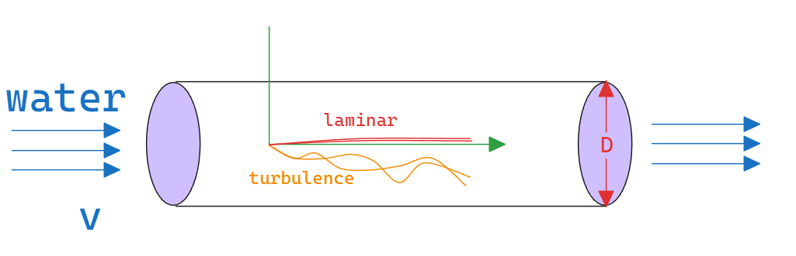

$$
Re_D=\frac{vD}{\nu}
\\
工程常用转捩雷诺数Re_{cr}=2300
$$

### 可压不可压

马赫数>0.3为可压缩

### 单向流和多相流 multi_phase lfow

空化cavitation和汽蚀（空蚀）erosion

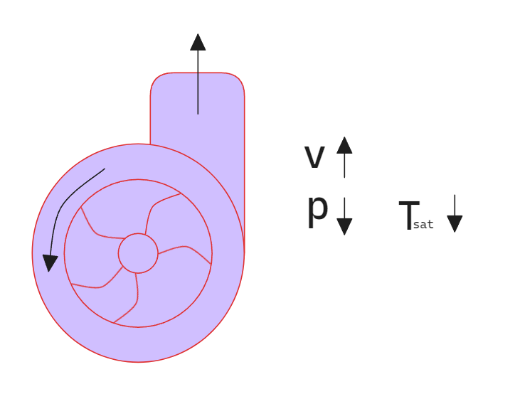

### 涡 vortex

一般自然界的都是涡强制涡自由涡两种涡的复合态，
台风外围自由涡，但中心近似刚体；

####  强制涡

类似刚体运动，切向速度正比于半径
$$
\vec v \propto r
\\
\vec v = kr
$$

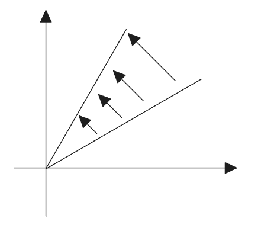

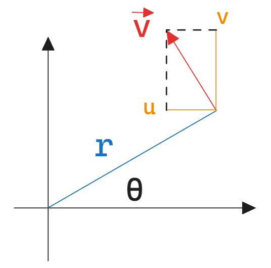
$$
u=-\Omega r\sin\theta=-\Omega y
\\
v=\Omega r\cos\theta=\Omega x
\\
$$
显然没有线变形
$$
\\
\dot\varepsilon_x = \frac{\part u }{\part x}=0
\\
\dot\varepsilon_y = \frac{\part v }{\part y}=0
$$
剪切变形
$$
\dot\Gamma_{xy}=\frac{\part v}{\part x}+\frac{\part u}{\part y}=\Omega-\Omega=0
$$
角速度或者涡量
$$
\Omega_z=\frac12(\frac{\part v}{\part x}-\frac{\part u}{\part y})=\frac12(\Omega+\Omega)=\Omega 
\\
\omega_z=2\Omega_z
$$

#### 自由涡

自由涡的中心旋转角速度无穷大，但是速度向外则和半径成反比；
$$
\vec v \propto \frac1r
$$

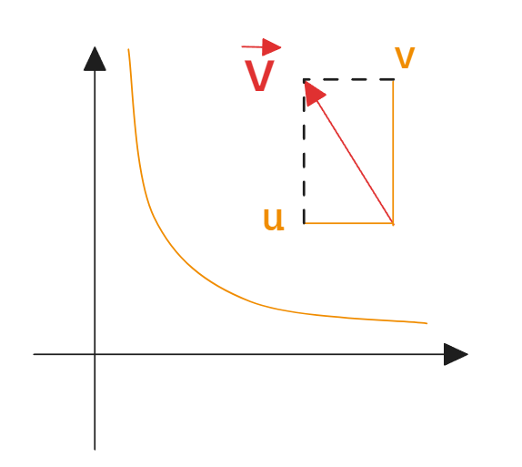
$$
\vec v \propto \frac1r
\\
设\vec v = a/r
\\
u = -\vec v \sin\theta  =-\frac ar  \sin\theta =-\frac a{r^2} r\sin\theta =-\frac a{x^2+y^2}y
\\
u = -\frac a{x^2+y^2}y
\\
v= \frac a{x^2+y^2}x
$$
查看线变形
$$
\dot\varepsilon_x = \frac{\part u }{\part x}=-\frac{2axy}{(x^2+y^2)^2}
\\
\dot\varepsilon_y= \frac{\part v }{\part y}= \frac{2axy}{(x^2+y^2)^2}
$$
剪切变形
$$
\dot\Gamma_{xy}=
\frac{\part v}{\part x}+\frac{\part u}{\part y}=
\frac{-2ax^2+2ay^2}{(x^2+y^2)^2} 
\\
$$
涡量
$$
\Omega_z=\frac12(\frac{\part v}{\part x}-\frac{\part u}{\part y})=0
$$
自由涡除了中心外都是无旋流动（势流）

