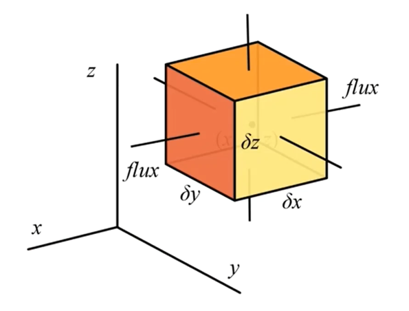

# 01_方法介绍

[TOC]

# NS方程经典数值模拟方法

 

## 数理基础

基本假设和流动运动学描述

基本假设和参量守恒

连续性假设：真实流体或者酷图占有得空间近似看作连续无空隙充满质点；

> 要注意：随着测量范围减小，分子数在空间内的数量波动变大，突破了连续性；
> 不能用连续介质假设的情况，如稀薄气体和激波，只能用分子动力学，蒙特卡洛、矩方法

### 流体力学方程

连续性方程-质量守恒

动量守恒方程-牛顿第二定律  N-S核心来源

能量守恒方程-热力学第一定律

### 流动现象的四个描述方法

#### 拉格朗日观点

选取流体微团做拉格朗日运动学；

将流体微团位置标记$x=x(a,b,c,t)$  ,那么任意瞬时速度 $v=\frac{dx}{dt}=v(a,b,c,t)$

#### 欧拉观点

固定流程内任意空间位置，考察流体流经该空间的力学情况；

由于空间固定，流体经过，故每个时刻提取的物理量由不同质点携带；

公式表达
$$
设物理量 \Phi(x,t) ,此时位置x，时间t
\\
物理量其随时间变化率： 
\\
\frac{D[\Phi(x,t)]}{Dt} = 
\frac{\part\Phi}{\part t}+\frac{dx}{dt}\cdot\nabla\Phi = 
\frac{\part\Phi}{\part t}|_x+u\cdot\nabla\Phi 
\\
其中
\\
\frac{\part\Phi}{\part t}|_x 为随体导数物质导数
\\
u\cdot\nabla\Phi 为局部导数
$$

|          | 欧拉观点                                                     | 拉格朗日观点                           |
| -------- | ------------------------------------------------------------ | -------------------------------------- |
| 积分形式 | $\frac{\part}{\part t}\iiint_v\rho dV+\iint_S\rho U\cdot S=0$ | $\frac{D}{Dt}\iiint_V\rho dV=0$        |
| 微分形式 | $\frac{\part}{\part t}+\nabla\cdot(\rho U)=0$                | $\frac{D\rho}{Dt}+\rho\nabla\cdot U=0$ |

四种方式衍生的计算方法分类

欧拉方法：FEM+FDM,FVM

拉格朗日方法：SPH,MPS

 

### NS 方程组推导

#### 连续性方程-质量守恒

$$
假设六面体，流体通过其六面体，流体质量通量为f，中心坐标为(x,y,z)
\\ 
先看x方向的两个面，面积为a_x=\delta y\delta z 
\\
由于微团体积V=\delta x\delta y\delta z ，假设体积不变
\\
微团自身动量为 m\vec u=\rho V\vec u=\rho  \vec u \delta x\delta y\delta z
\\ 
那么此时 \rho \vec u 便可代表单位体积含动量，也成为质量对流项，量纲 \frac{g}{mm^2\cdot s}，也代表通过单位平面的每秒质流量
\\
该动量在x为法线切薄片上瞬间表现作用就是\frac{d(\rho\vec u)}{d x}，量纲 \frac{g}{mm^3\cdot s}，代表通过单位体积的每秒质流量
\\\\
从微团两个面进出的净通量(每秒质流量)可表达为 \frac{\part(\rho\vec u)}{\part x}\delta x\delta y\delta z，量纲\frac gs
\\
扩展到其他方向得到
\\
\frac{\part(\rho\vec u)}{\part x}\delta x\delta y\delta z
\\
\frac{\part(\rho\vec v)}{\part y}\delta x\delta y\delta z
\\
\frac{\part(\rho\vec w)}{\part z}\delta x\delta y\delta z
$$

$$
\\
上述微团【单位体积】通量总和可写为 
[\frac{\part(\rho u_x)}{\part x}+\frac{\part(\rho u_y)}{\part y}+\frac{\part(\rho u_z)}{\part z}] =
\nabla(\rho\vec u) ，量纲\frac g{mm^3\cdot s}
\\
即【单位体积】通量为\nabla(\rho\vec u)，即为【单位体积】内的质量变化，量纲\frac g{mm^3\cdot s}
\\
微团【单位时间】内【单位体积】的质量变化 \frac{\part\rho}{\part t}
\\
于是上述两者从不同录像描述的物理量相同，可做【单位体积】内【单位时间】内的质量守恒
\\
即\nabla(\rho\vec u) = - \frac{\part\rho}{\part t}
\Rightarrow
\frac{\part\rho}{\part t} + \nabla\cdot(\rho\vec u)=0
\\
到此我们得到了欧拉观点的方程，稍微修改下能够得到拉格朗日公式
\\
\frac{\part\rho}{\part t} + \nabla\cdot(\rho\vec u)=
\frac{\part\rho}{\part t} + u\cdot\nabla\rho+ \rho\nabla\cdot\vec u = 
\frac{D\rho}{Dt}+\rho\nabla\cdot\vec u=0
\\
$$

#### 连续性方程-动量守恒

动量守恒方程-牛顿第二定律  N-S核心来源

能量守恒方程-热力学第一定律

## 离散结束

## 专题讨论

## 案例介绍

