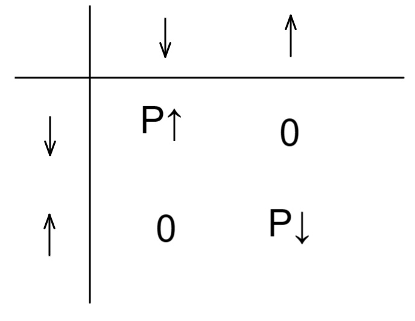
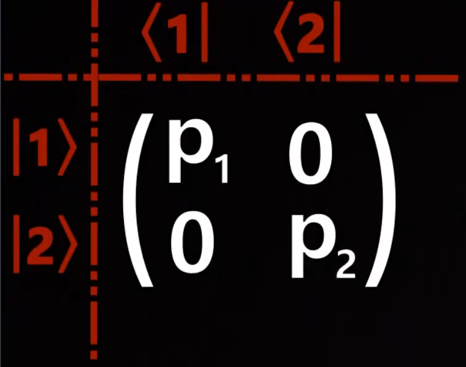

# 量子力学的数学基础

[TOC]

## 概率论

### 古典概型

#### 有限个等概率事件

常见例子是骰子或者硬币的概率；

我们知道骰子每个面的经典概率为  $\frac16$  那么 如果 骰子出现1-3 得到10 元  ， 出现4-6 失去20元 ，最后总概率为

$10\times\frac16+10\times\frac16+10\times\frac16=5 \\ (-20)\times\frac16+(-20)\times\frac16+(-20)\times\frac16=-10 \\ final=-5$

#### 互斥事件

还是骰子例子，骰子出现小于等于3（即 1 2 3）为集合A，若骰子出现奇数（即1 3 5）为一个集合B，那么这两个概率通过等概率古典概型得到其实都是  $P_A=\frac12=P_B$   , 但是如果说要找到   既是小于等于3  又是奇数 的概率 此时无法将连个概率相加；其中 出现 1 3 的情况是重复基计数的，实际的概率为 $\frac46$ ；

可见只有互斥事件的时候，概率才可相加 ;

在经典解释中，硬币一次抛出的结果不可能既是正又是反；两个情况是互斥的， 所以这两个情况的概率可加；

####  独立事件

两个事件 A B 发生的概率互相之间不影响，$P_A$   $P_B$ 是独立的 ；那么 两个事件同时发生的概率为   $P_{AB}=P_A \times P_B $

#### 概论基本公式

那么得到概论最为基本的公式：

$P(A \cup B) = P(A)+P(B) \\ P(A \cap B) = P(A)\times P(B)$

### 狄拉克符号重表达概率

#### 符号定义

我们使用一种新的符号来表达一个事件的状态；  braket 符号

$| \uparrow \rang$   表达向上状态      

$| \downarrow \rang$   表达向下状态  

例如，我们需要表达一个硬币的状态 $\rho^c$

当硬币处于向上状态的时候 概率表为    $\frac12|\uparrow\rang \lang\uparrow|$

当硬币处于向下状态的时候 概率表为    $\frac12|\downarrow\rang\lang\downarrow|$

一个硬币的概率状态为  $\rho^c=
P_{\uparrow}|\uparrow\rang \lang\uparrow|+P_{\downarrow}|\downarrow\rang\lang\downarrow|=
\frac12|\uparrow\rang \lang\uparrow|+\frac12|\downarrow\rang\lang\downarrow|$

 其实对于硬币状态以前是写为列表的

> 这里提前提出   狄拉克符号 在线性代数的表达 
>
> $\lang\uparrow| = 
> \left ( 
> \begin{matrix}
> \uparrow & 0   \\
> \end  {matrix} 
> \right ) , 
> |\uparrow\rang = 
> \left ( 
> \begin{matrix}
> \uparrow   \\
>  0   \\
> \end  {matrix} 
> \right )$ 
>
> $|\uparrow\rang\lang\uparrow| = 
> |\uparrow\rang = 
> \left ( 
> \begin{matrix}
> \uparrow   \\
>  0   \\
> \end  {matrix} 
> \right ) 
> \left ( 
> \begin{matrix}
> \uparrow & 0   \\
> \end  {matrix} 
> \right ) = 
> \left ( 
> \begin{matrix}
> \uparrow & 0   \\
> 0 &  0        \\
> \end  {matrix} 
> \right ) $
>
> 同理，第二位置表示另一个事件发生
>
> $|\downarrow\rang\lang\downarrow| = 
> |\downarrow\rang = 
> \left ( 
> \begin{matrix} 
> 0   \\
> \downarrow   \\
> \end  {matrix} 
> \right ) 
> \left ( 
> \begin{matrix}
>  0&\downarrow   \\
> \end  {matrix} 
> \right ) = 
> \left ( 
> \begin{matrix}
> 0 & 0   \\
> 0 &  \downarrow       \\
> \end  {matrix} 
> \right ) $
>
> 则有
>
> $|\uparrow\rang \lang\uparrow|+ |\downarrow\rang\lang\downarrow|=
> \left ( 
> \begin{matrix}
> \uparrow & 0   \\
> 0 &  \downarrow       \\
> \end  {matrix} 
> \right ) $
>
> 如此使用矩阵做状态表达，故矩阵可以用来表达状态
> 之后都的情况可以扩展为上述形式，可见状态矩阵就是各个事件作为基础构造的空间信息；

回到之前内容  ，若我需要对各个状态加上系数  若硬币正面得到10元  反面失去20元 则有

$A=
E_{\uparrow}|\uparrow\rang \lang\uparrow|+E_{\downarrow}|\downarrow\rang\lang\downarrow|=
10|\uparrow\rang \lang\uparrow|-20|\downarrow\rang\lang\downarrow|$

既然我们得到了 硬币状态的概率   $\rho$  以及  在不同状态中得失   A  , 我们就可以计算整个场的均值收益 

方便期间我们直接将状态定义为矩阵

$M_\uparrow = |\uparrow\rang\lang\uparrow|,M_\downarrow= |\downarrow\rang\lang\downarrow|$     

且我们知道 硬币的上下状态是经典互斥事件，那么  

$M_\uparrow M_\uparrow = M_\downarrow M_\downarrow =1 \\ 
M_\uparrow M_\downarrow = M_\downarrow M_\uparrow =0$

乘积之后求矩阵的迹

$\rho\times A = 
E_\uparrow P_\uparrow M_\uparrow M_\uparrow+
E_\downarrow P_\downarrow M_\downarrow M_\downarrow +
E_\uparrow P_\downarrow M_\uparrow M_\downarrow +
E_\downarrow P_\uparrow M_\downarrow M_\uparrow =
E_\uparrow P_\uparrow M_\uparrow + E_\downarrow P_\downarrow M_\downarrow \\= 
E_\uparrow P_\uparrow  |\uparrow\rang\lang\uparrow| + E_\downarrow P_\downarrow  |\downarrow  \rang\lang\downarrow  |$

那么按照这个样式求迹就可以得到

代入矩阵  $\rho A =  E_\uparrow P_\uparrow M_\uparrow + E_\downarrow P_\downarrow M_\downarrow $

$ Trace(\rho\times A) = 
Tr[E_\uparrow P_\uparrow M_\uparrow + E_\downarrow P_\downarrow M_\downarrow ]
\\=
Tr[E_\uparrow P_\uparrow 
\left ( 
\begin{matrix}
\uparrow & 0   \\
0 &  0        \\
\end  {matrix} 
\right )  + 
E_\downarrow P_\downarrow  
\left ( 
\begin{matrix}
0 & 0   \\
0 &  \downarrow       \\
\end  {matrix} 
\right ) ] \\= 
\left ( 
\begin{matrix}
E_\uparrow P_\uparrow \uparrow & 0    \\
0 &  E_\downarrow P_\downarrow\downarrow       \\
\end  {matrix} 
\right )= 
E_\uparrow P_\uparrow +E_\downarrow P_\downarrow   \\
$

如果代入狄拉克符   $\rho A = E_\uparrow P_\uparrow  |\uparrow\rang\lang\uparrow| + E_\downarrow P_\downarrow  |\downarrow  \rang\lang\downarrow  |$，也可以写为

$Tr(A\rho) =
\lang\uparrow|A\rho|\uparrow\rang + \lang\downarrow|A\rho|\downarrow\rang =
\lang\uparrow|(E_\uparrow P_\uparrow  |\uparrow\rang\lang\uparrow| + E_\downarrow P_\downarrow  |\downarrow  \rang\lang\downarrow  |)|\uparrow\rang + \lang\downarrow|(E_\uparrow P_\uparrow  |\uparrow\rang\lang\uparrow| + E_\downarrow P_\downarrow  |\downarrow  \rang\lang\downarrow  |)|\downarrow\rang \\=
E_\uparrow P_\uparrow+E_\downarrow P_\downarrow$

#### 正交

那么上述有个经典互斥事件的表达 $M_\uparrow M_\uparrow = M_\downarrow M_\downarrow =1 \\ 
M_\uparrow M_\downarrow = M_\downarrow M_\uparrow =0$  称为正交；

抽象为 正交  $\lang \nu|\mu\rang=\delta \nu|\mu = 
\left\{
\begin{array}{lr}
0, \mu\neq\nu \\
1, \mu=\nu
\end{array}\right. $  这就表明上下状态不可能同时发生，是独立的互斥的情况 ， 这里的$\delta$就是克罗内克尔符号；

#### 解释

那么为何量子力学需要这样的符号表达概率？
主要由于量子的特性导致其在两个状态之间游移，两个状态在经典情况下正交互不影响，而作为向量可以保留有互相影响的潜力，同时可以兼容经典力学情况下的概率互斥事件的解释；这样数学就可以同时在经典力学和量子力学环境中写法几乎不变
那么两个状态的狄拉克符，两个状态就表达为矩阵空间正交的向量，左右矢影响行列：

#### 操作矩阵

那么状态的情况完成了，接下来是操作的矩阵动作

反转的通用公式为 $\rho_f=A\rho_iA^\dagger , \ A^\dagger = (A^\top)^*$    ， 这里的匕首符就是矩阵转置，而带有复数矩阵转置必须搭配共轭，匕首符即复数矩阵的转置；

显然单位矩阵为不变操作矩阵   $I = 
\left ( 
\begin{matrix}
1 & 0   \\
0 & 1   \\ 
\end  {matrix} 
\right )  $  ， 

那么反转矩阵为     $I_r = 
\left ( 
\begin{matrix}
0 & 1   \\
1 & 0   \\ 
\end  {matrix} 
\right )  $   

可以自行验算，那么如果之后实验情况下，经过操作的时候就采用这个状态计算    

$\rho_末=A\rho_始 A^\dagger$

上述为硬币两个状态的情况 ， 那骰子则有6个经典状态 ，可以自行试着计算

#### 状态总结

那么我们总结一下

##### 经典情况

两个事件的独立互斥表达   $\lang \nu|\mu\rang=\delta \nu|\mu = 
\left\{
\begin{array}{lr}
0, \mu\neq\nu \\
1, \mu=\nu
\end{array}\right. $

出现状态的概率密度分布    $\rho^c=\sum\limits_\alpha p_\alpha|\alpha\rang\lang\alpha| $

各个状态的收益综合，也叫测量算符   $A=\sum\limits_\alpha  \alpha|\alpha\rang\lang\alpha| $

测量结果收益计算  $p_\alpha=\lang\alpha|\rho^c|\alpha\rang , \lang A\rang_{\rho^c}=tr(A\rho^c)$

将某状态进行变换   $\rho^c_f=A \rho^c_i A^\dagger$

##### 量子情况

状态相干叠加  $ \psi\rang = |1\rang+|2\rang$  

概率密度函数为  $\rho=
(|1\rang+|2\rang)(\lang1|+\lang2|) =
|1\rang\lang1|+|1\rang\lang2|+|2\rang\lang1|+|2\rang\lang2| $   出现了非对角元

测量后状态，两端为测量后状态     $p^c_{afm}=|m\rang\lang m |p^c_{bfm}|m\rang\lang m | $

这里的测量后状态其实是量子通过变换后取得某一振动分量的矩阵形式

 

