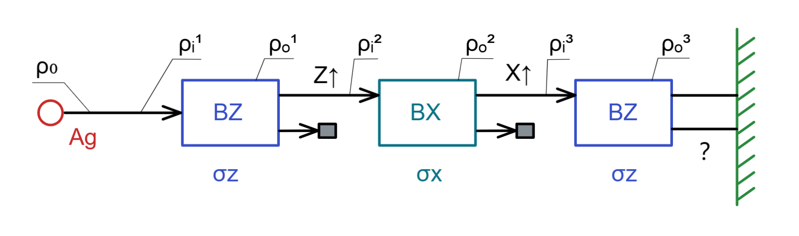

# 量子实验与解析

[TOC]

## 基本提示

对于量子实验的解释有几个要点：

首先对于微观粒子，即量子来说，人们总是看作一个粒子，但从性质来说和波非常相似；
以经典的理论解释波是可以匹配一系列实验结果的
在经典的波视角下，具有几个结症：
结症1在于量子的能量已经为最小不可分，只能视为粒子而非波；
结症2在于如果量子真的是波动，那么单个量子的能量变化应该会多阶梯型或者连续变化，而量子做不到；

于是有了量子力学的视角，对于所有传统概率模型来说的互斥事件，在量子尺度下可以同时存在；
导致了一系列的量子力学数学模型，同时也导致了后续类似量子纠缠这类的纯数学模型，而人类在工程上并未做到的理论情况；
也许你可以说，表现为粒子只是波动能量在我们观察范围下的投影，可由于实验物理观测限制，这些说法只能是数学推论；

最小能量导致了下述实验所有非零元素都转为1的情况；

## Stern Gerlach 量子自旋实验

实验装置如下

银原子通过三个磁场的自旋方向变化，后期其他实验表明其实电子也循序类似规律；
银原子通过磁场BZ1，会发生自旋变化 ，通常会分为两束，把两种状态定义为 向上或向下 ；是个两变量随机模型；
磁场相当于对量子进行测量，则量子会确定自己的自旋状态；

BZ1磁场影响原子Z方向的自旋变化，作用后仅让  $Z\uparrow$ 方向的原子束通过， 其他方向阻拦，通过者进入第二个磁场BX2
BX2磁场影响原子X方向的自旋变化，作用后仅让  $X\uparrow$ 方向的原子束通过， 其他方向阻拦，通过者进入第三个磁场BZ3
BZ3磁场影响原子Z方向的自旋变化，那么通过这个磁场后的原子束自旋的状态是会出现几种？

我们假定所有概率密度为  $\rho$ ，每次通过磁场都会有所变化；

我们假定磁场的影响矩阵及其本征态为  ，本征态即为影响矩阵的本征向量；可理解为实验得到的两个基本运动方式；
$\sigma_x=
\left ( 
\begin{matrix}
0 & 1   \\
1 & 0   \\ 
\end  {matrix} 
\right ) ,
\sigma_{xE} = (1,1)^\dagger  ,(1,-1)^\dagger $
$\sigma_z=
\left ( 
\begin{matrix}
1 & 0  \\
0 & -1   \\ 
\end  {matrix} 
\right ) ,
\sigma_{zE} = (1,0)^\dagger  ,(0,1)^\dagger   $
 其本征态即为不同自旋方向的状态表达 即 

$|x_\uparrow\rang = 
\left ( 
\begin{matrix}
1    \\
1    \\ 
\end  {matrix} 
\right ) ,
|x_\downarrow\rang = 
\left ( 
\begin{matrix}
1    \\
-1    \\ 
\end  {matrix} 
\right ) $

$|z_\uparrow\rang = 
\left ( 
\begin{matrix}
1    \\
0    \\ 
\end  {matrix} 
\right ) ,
|z_\downarrow\rang = 
\left ( 
\begin{matrix}
0    \\
1    \\ 
\end  {matrix} 
\right ) $

由此得到概率密度矩阵

$M_{x\uparrow}= |x_\uparrow\rang\lang x_\uparrow| = 
\left ( 
\begin{matrix}
1 & 1   \\
1 & 1   \\ 
\end  {matrix} 
\right ) , 
M_{x\downarrow}= |x_\downarrow\rang\lang x_\downarrow| = 
\left ( 
\begin{matrix}
1 & -1   \\
-1 & 1   \\ 
\end  {matrix} 
\right )   $
$M_{z\uparrow}= |z_\uparrow\rang\lang z_\uparrow| = 
\left ( 
\begin{matrix}
1 & 0   \\
0 & 0   \\ 
\end  {matrix} 
\right ) , 
M_{z\downarrow}= |z_\downarrow\rang\lang z_\downarrow| = 
\left ( 
\begin{matrix}
0 & 0   \\
0 & 1   \\ 
\end  {matrix} 
\right )   $

完成上述准备工作 ， 接下来进入实验流程 

首先写出初始的概率密度矩阵 ，由于此时状态未作测量和改变，那么两变量随机模型其迹必然为0 ， 故 假设为主轴  1  和  -1 的矩阵，上标为阶段编号；

$\rho_o=
\left ( 
\begin{matrix}
1 & 0   \\
0 & -1   \\ 
\end  {matrix} 
\right ) =\rho_i^1 $

此时经过磁场 BZ1 影响了 Z 方向的自旋，得到上自旋和下自旋的综合密度矩阵，然后根据测量后状态提取某一自旋的密度矩阵
这里需要注意，磁场相当于对原子做了测量，该动作导致了原子自旋的Z方向状态确定，那么其综合概率矩阵就确定，使用前后测量公式仅仅是把综合概率中的 $Z\uparrow$ 自旋概率矩阵提出来；

$\rho^1_o=\sigma_z\rho^1_i=
\left ( 
\begin{matrix}
1 & 0   \\
0 & -1   \\ 
\end  {matrix} 
\right )  
\left ( 
\begin{matrix}
1 & 0   \\
0 & -1   \\ 
\end  {matrix} 
\right ) =
\left ( 
\begin{matrix}
1 & 0   \\
0 & 1   \\ 
\end  {matrix} 
\right )   $

$\rho^1_{z\uparrow}=M_{z\uparrow} \rho^1_o M_{z\uparrow}=
\left ( 
\begin{matrix}
1 & 0   \\
0 & 0   \\ 
\end  {matrix} 
\right ) 
\left ( 
\begin{matrix}
1 & 0   \\
0 & 1   \\ 
\end  {matrix} 
\right ) 
\left ( 
\begin{matrix}
1 & 0   \\
0 & 0   \\ 
\end  {matrix} 
\right ) =
\left ( 
\begin{matrix}
1 & 0   \\
0 & 0   \\ 
\end  {matrix} 
\right ) 
=\rho^2_i$

$\rho^1_{z\downarrow}=M_{z\downarrow} \rho^1_o M_{z\downarrow}=
\left ( 
\begin{matrix}
0 & 0   \\
0 & 1   \\ 
\end  {matrix} 
\right ) 
\left ( 
\begin{matrix}
1 & 0   \\
0 & 1   \\ 
\end  {matrix} 
\right ) 
\left ( 
\begin{matrix}
0 & 0   \\
0 & 1   \\ 
\end  {matrix} 
\right ) =
\left ( 
\begin{matrix}
0 & 0   \\
0 & 1   \\ 
\end  {matrix} 
\right ) =blocked$

可见   $\rho^1_o = \rho^1_{z\uparrow} +\rho^1_{z\downarrow} $  此时概率密度可以叠加 可以使用经典理论解释，因为其目前仅包含Z方向的自旋差别

那么我们继续将可以通过的原子束  $\rho^2_i$  再通过磁场BX2 ，再次使用上面的做法

$\rho^2_o=\sigma_x\rho^2_i=
\left ( 
\begin{matrix}
0 & 1   \\
1 & 0   \\ 
\end  {matrix} 
\right )  
\left ( 
\begin{matrix}
1 & 0   \\
0 & 0   \\ 
\end  {matrix} 
\right ) =
\left ( 
\begin{matrix}
0 & 0   \\
1 & 0   \\ 
\end  {matrix} 
\right )   $

$\rho^2_{x\uparrow}=
M_{x\uparrow} \rho^2_o M_{x\uparrow}=
\left ( 
\begin{matrix}
1 & 1   \\
1 & 1   \\ 
\end  {matrix} 
\right ) 
\left ( 
\begin{matrix}
0 & 0   \\
1 & 0   \\ 
\end  {matrix} 
\right ) 
\left ( 
\begin{matrix}
1 & 1   \\
1 & 1   \\ 
\end  {matrix} 
\right ) =
\left ( 
\begin{matrix}
1 & 1   \\
1 & 1   \\ 
\end  {matrix} 
\right ) 
=\rho^3_i$

$\rho^2_{x\downarrow}=
M_{x\downarrow} \rho^2_o M_{x\downarrow}=
\left ( 
\begin{matrix}
1 & -1   \\
-1 & 1   \\ 
\end  {matrix} 
\right ) 
\left ( 
\begin{matrix}
0 & 0   \\
1 & 0   \\ 
\end  {matrix} 
\right ) 
\left ( 
\begin{matrix}
1 & -1   \\
-1 & 1   \\ 
\end  {matrix} 
\right ) =
\left ( 
\begin{matrix}
-1 & 1   \\
1 & -1   \\ 
\end  {matrix} 
\right ) 
=blocked$

可见   $\rho^2_o \neq \rho^2_{x\uparrow} +\rho^2_{x\downarrow} $  此时可见概率无法叠加，那么说明其x的自旋中包含了其他方向的自旋因素，经典理论无法解释该情况
由之前的动作我们应该猜到，在该状态的量子的x方向自旋中含有z方向的自旋信息

那么接下来我们继续将可以通过的原子束  $\rho^3_i$  再通过磁场BZ3 ，再次使用上面的做法

 $\rho^3_o=\sigma_z\rho^3_i=
\left ( 
\begin{matrix}
1 & 0   \\
0 & -1   \\ 
\end  {matrix} 
\right )  
\left ( 
\begin{matrix}
1 & 1   \\
1 & 1   \\ 
\end  {matrix} 
\right ) =
\left ( 
\begin{matrix}
1 & 1   \\
-1 & -1   \\ 
\end  {matrix} 
\right )   $

此时我们不做阻拦，直接看通过该磁场后的概率密度矩阵，可见其迹为0，说明两个状态的发射概率各一半

$Tr(\rho^3_o)=0$

那么得到结论，再通过所有磁场后，出现的原子束，会有两束；

